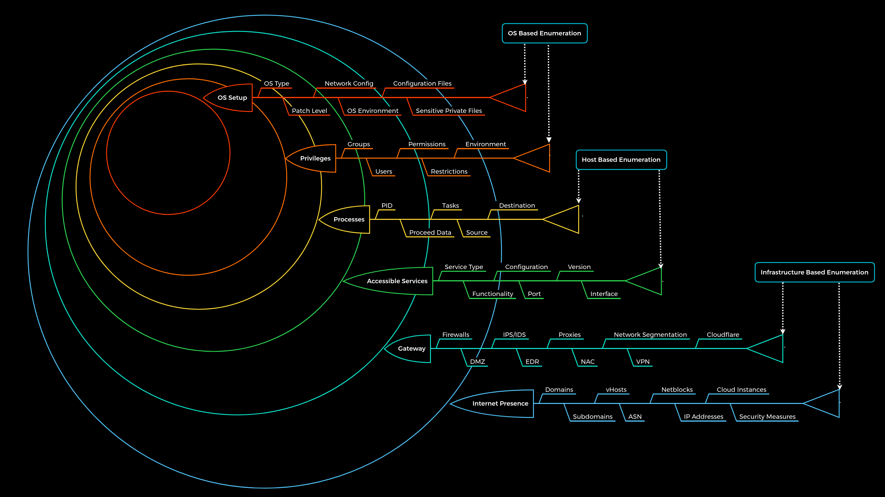

# Footprinting

### Table of Contents
- [Enumeration Prinicples](#enumeration-principles)
- [Enumeration Methodology](#enumeration-methodology)

### Enumeration Principles

Use passive and active enumeration to gather information from various sources (IPs, domains 
accessible services etc.)

- How is the company structured
- What services does it use
- What third-party vendors does it use
- What security measures may be in place
- How is the infrastructure set up
- How do they provide the services they offer

**The goal is not to get at the systems but to find all ways to get there**

Questions to answer when enumerating:

- What can we see?
- What reasons can we have for seeing it?
- What image does what we see create for us?
- What do we gain from it?
- How can we use it?
- What can we not see?
- What reasons can there be that we do not see?
- What image results for us from what we do not see?

**The Enumeration Principles**

1. There is more than meets the eye. Consider all points of view
2. Distinguish between what we see and what we do not see
3. There are always ways to gain more information. Understand the target

### Enumeration Methodology

The enumeration process is divided into three levels:

1. Infrastructure-based enumeration
2. Host-based enumeration
3. OS-based enumeration

