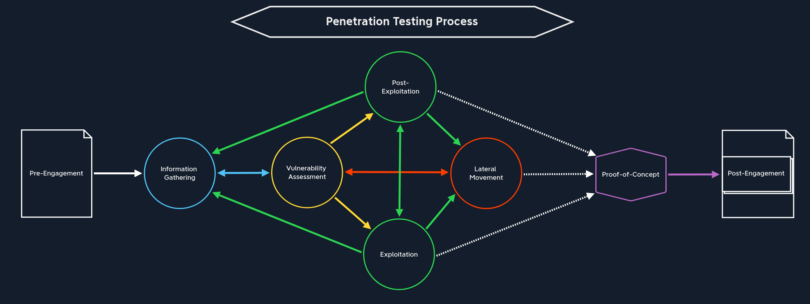
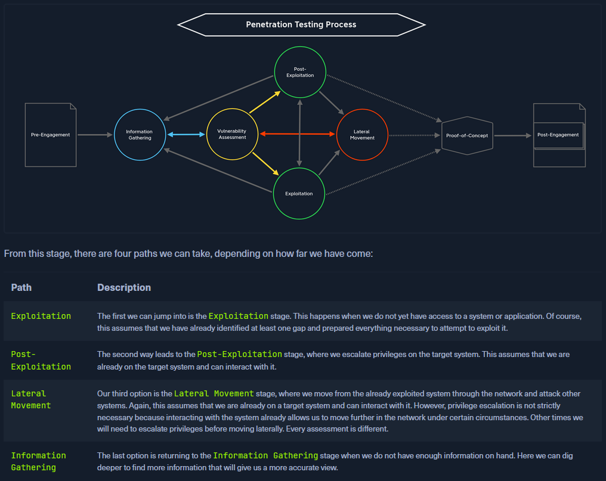
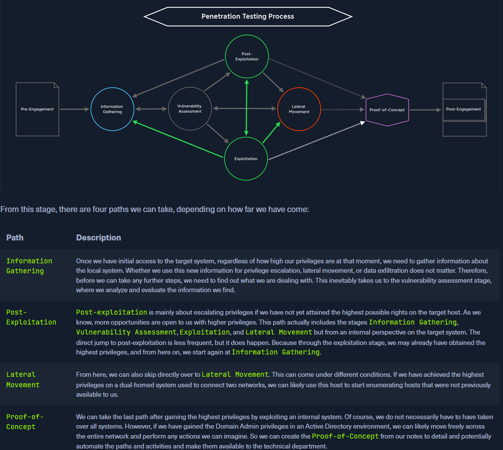
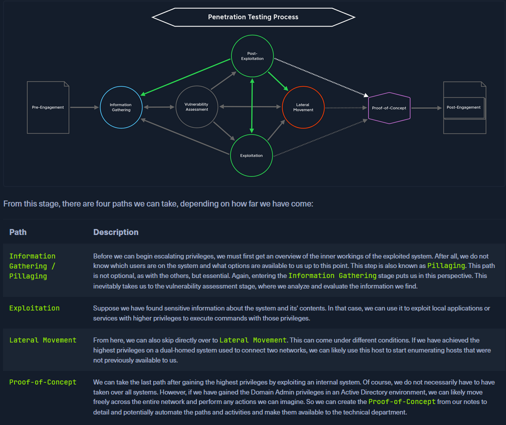
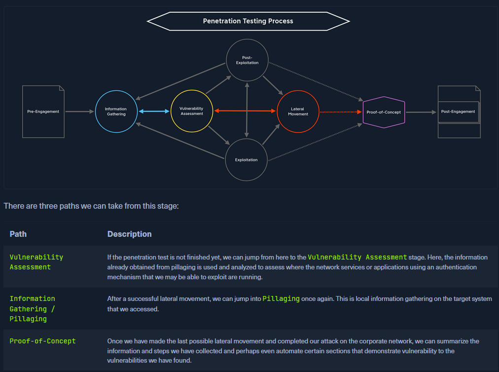
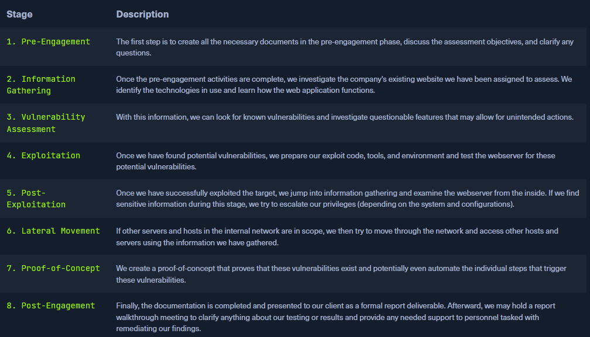

# Penetration Testing Process

### Table of Contents
- [Pre-Engagement](#1-pre-engagement)
	- [Documents to Prepare](#documents-to-prepare)
	- [Scoping Questionnaire](#scoping-questionnaire)
	- [Pre-Engagement Meeting](#pre-engagement-meeting)
		- [Contract Checklist](#contract-checklist)
		- [RoE Checklist](#roe-checklist)
	- [Kick-Off Meeting](#kick-off-meeting)
		- [Contractors Agreement](#contractors-agreement)
			- [Contractors Agreement checklist](#contractors-agreement-checklist)
	- [Modules](#pre-engagement-modules)
		- [Setting Up Tools](#setting-up-tools)
- [Information Gathering](#2-information-gathering)
	- [Open-Source Intelligence](#open-source-intelligence)
	- [Infrastructure Enumeration](#infrastructure-enumeration)
	- [Host Enumeration](#host-enumeration)
	- [Pillaging](#pillaging)
	- [Modules](#information-gathering-modules)
		- [Network Enumeration with Nmap](#network-enumeration-with-nmap)
- [Vulnerability Assessment](#3-vulnerability-assessment)
- [Exploitation](#4a-exploitation)
- [Post-Exploitation](#5-post-exploitation)
- [Lateral Movement](#6-lateral-movement)
- [Proof-of-Concept](#7-proof-of-concept)
- [Post-Engagement](#8-post-engagement)
- [Types of Testing Environments](#types-of-testing-environments)

### Tips

- Strong knowledge of basics to provide value fast
- Build my own methodology
- Ethical and legal considerations are crucial, OSINT and info gathering are OK (provided sources are public),
scanning is not
- Reinforce skills with bug bounty work
- Always get a copy of the signed scope of work/contract and a formal doc listing the scope of testing (URLs,
IP addresses, CIDR network ranges, wireless SSIDs, facilities for physical assessments, lists of emails and
phone numbers for social engineering engagements) signed by the client!
- If additional items are added to the scope get it in writing!
- Do no harm, always get written consent when performing any actions that may impact the client's network or
services
- Document, document, document
- When in doubt document and overcommunicate
- After this path specialize in one subject while continuing to build skills in all areas to become as 
well-rounded as possible

## 1. Pre-Engagement

Commitments, tasks, scope, limitations and related agreements are documented. Contracts are drawn up and 
essential information is exchanged.

1. Scoping questionnaire
2. Pre-engagement meeting
3. Kick-off meeting

Before discussing any of the above in detail a NDA must be signed by all parties

| Type | Description |
|------|-------------|
| Unilateral NDA | A Unilateral NDA obligates only one party to maintain confidentiality and allows the other party to share the information received with third parties. |
| Bilateral NDA | A Bilateral NDA obligates both parties to keep the resulting and acquired information confidential. This is the most common type of NDA that protects the work of penetration testers. |
| Multilateral NDA | A Multilateral NDA is a commitment to confidentiality by more than two parties. If we conduct a penetration test for a cooperative network, all parties responsible and involved must sign this document. |

**We must know who in the company is permitted to contract us for a penetration test**

Sample list:

- Chief Executive Officer (CEO)
- Chief Technical Officer (CTO)
- Chief Information Security Officer (CISO)
- Chief Security Officer (CSO)
- Chief Risk Officer (CRO)
- Chief Information Officer (CIO)
- VP of Internal Audit
- Audit Manager
- VP or Director of IT/Information Security

**Must have information:**

- Who has signatory authority for the contract?
- Rules of Engagement documents
- Primary and secondary points of contact
- Technical support
- Contact for escalating any issues

### Documents to prepare

***These documents should be reviewed and adapted by a lawyer after preparation***

| Document | Timing for Creation |
|----------|---------------------|
| 1. Non-Disclosure Agreement (NDA) | After Initial Contact |
| 2. Scoping Questionnaire | Before the Pre-Engagement Meeting |
| 3. Scoping Document | During the Pre-Engagement Meeting |
| 4. Penetration Testing Proposal (Contract/Scope of Work (SoW)) | During the Pre-engagement Meeting |
| 5. Rules of Engagement (RoE) | Before the Kick-Off Meeting |
| 6. Contractors Agreement (Physical Assessments) | Before the Kick-Off Meeting |
| 7. Reports | During and after the conducted Penetration Test |

### Scoping Questionnaire

The scoping questionnaire should clearly explain our services and may ask them to choose one or more from 
a list of assessments we provide

Under each option the questionnaire should allow the client to provide specifics about the chosen 
assessment

**Must have information:**

- How many expected live hosts?
- How many IPs/CIDR ranges in scope?
- How many domains/subdomains in scope?
- How many wireless SSIDs in scope?
- How many web/mobile applications? If testing is authenticated, how many roles (standard user, admin, 
etc.)?
- For a phishing assessment, how many users will be targeted? Will the client provide a list, or will we be 
required to gather this list via OSINT?
- If the client is requesting a Physical Assessment, how many locations? If multiple sites are in scope, are 
they geographically dispersed?  
- What is the objective of the Red Team Assessment? Are any activities (such as phishing or physical 
security attacks) out of scope?  
- Is a separate Active Directory Security Assessment desired?
- Will network testing be conducted from an anonymous user on the network or a standard domain user?
- Do we need to bypass Network Access Control (NAC)?
- Is the Penetration Test black box (no information provided), grey box (only IP address/CIDR ranges/URLs 
provided), white box (detailed information provided)
- Would they like us to test from a non-evasive, hybrid-evasive (start quiet and gradually become "louder" 
to assess at what level the client's security personnel detect our activities), or fully evasive.

Using the information from the Scoping Questionnaire we create an overview and sumarize all information in 
the Scoping Document

### Pre-Engagement Meeting

Discuss and explain all relevant and essential components with the customer before the penetration test.

#### Contract Checklist

| Checkpoint | Description |
|------------|-------------|
| ☐ NDA | Non-Disclosure Agreement (NDA) refers to a secrecy contract between the client and the contractor regarding all written or verbal information concerning an order/project. The contractor agrees to treat all confidential information brought to its attention as strictly confidential, even after the order/project is completed. Furthermore, any exceptions to confidentiality, the transferability of rights and obligations, and contractual penalties shall be stipulated in the agreement. The NDA should be signed before the kick-off meeting or at the latest during the meeting before any information is discussed in detail. |
| ☐ Goals | Goals are milestones that must be achieved during the order/project. In this process, goal setting is started with the significant goals and continued with fine-grained and small ones. |
| ☐ Scope | The individual components to be tested are discussed and defined. These may include domains, IP ranges, individual hosts, specific accounts, security systems, etc. Our customers may expect us to find out one or the other point by ourselves. However, the legal basis for testing the individual components has the highest priority here. |
| ☐ Penetration Testing Type | When choosing the type of penetration test, we present the individual options and explain the advantages and disadvantages. Since we already know the goals and scope of our customers, we can and should also make a recommendation on what we advise and justify our recommendation accordingly. Which type is used in the end is the client's decision. |
| ☐ Methodologies | Examples: OSSTMM, OWASP, automated and manual unauthenticated analysis of the internal and external network components, vulnerability assessments of network components and web applications, vulnerability threat vectorization, verification and exploitation, and exploit development to facilitate evasion techniques. |
| ☐ Penetration Testing Locations | External: Remote (via secure VPN) and/or Internal: Internal or Remote (via secure VPN) |
| ☐ Time Estimation | For the time estimation, we need the start and the end date for the penetration test. This gives us a precise time window to perform the test and helps us plan our procedure. It is also vital to explicitly ask how time windows the individual attacks (Exploitation / Post-Exploitation / Lateral Movement) are to be carried out. These can be carried out during or outside regular working hours. When testing outside regular working hours, the focus is more on the security solutions and systems that should withstand our attacks. |
| ☐ Third Parties | For the third parties, it must be determined via which third-party providers our customer obtains services. These can be cloud providers, ISPs, and other hosting providers. Our client must obtain written consent from these providers describing that they agree and are aware that certain parts of their service will be subject to a simulated hacking attack. It is also highly advisable to require the contractor to forward the third-party permission sent to us so that we have actual confirmation that this permission has indeed been obtained. |
| ☐ Evasive Testing | Evasive testing is the test of evading and bypassing security traffic and security systems in the customer's infrastructure. We look for techniques that allow us to find out information about the internal components and attack them. It depends on whether our contractor wants us to use such techniques or not. |
| ☐ Risks | We must also inform our client about the risks involved in the tests and the possible consequences. Based on the risks and their potential severity, we can then set the limitations together and take certain precautions. |
| ☐ Scope Limitations & Restrictions | It is also essential to determine which servers, workstations, or other network components are essential for the client's proper functioning and its customers. We will have to avoid these and must not influence them any further, as this could lead to critical technical errors that could also affect our client's customers in production. |
| ☐ Information Handling | HIPAA, PCI, HITRUST, FISMA/NIST, etc. |
| ☐ Contact Information | For the contact information, we need to create a list of each person's name, title, job title, e-mail address, phone number, office phone number, and an escalation priority order. |
| ☐ Lines of Communication | It should also be documented which communication channels are used to exchange information between the customer and us. This may involve e-mail correspondence, telephone calls, or personal meetings. |
| ☐ Reporting | Apart from the report's structure, any customer-specific requirements the report should contain are also discussed. In addition, we clarify how the reporting is to take place and whether a presentation of the results is desired. |
| ☐ Payment Terms | Finally, prices and the terms of payment are explained. |

Most important element of the meeting is delivering the detailed presentation of the penetration test and 
its focus to the client

The Penetration Testing Proposal (Contract) and Rules of Engagement (RoE) are created from the Contract 
checklist and the information shared in the Scoping documents

#### RoE Checklist

| Checkpoint | Contents |
|------------|----------|
| ☐ Introduction | Description of this document. |
| ☐ Contractor | Company name, contractor full name, job title. |
| ☐ Penetration Testers | Company name, pentesters full name. |
| ☐ Contact Information | Mailing addresses, e-mail addresses, and phone numbers of all client parties and penetration testers. |
| ☐ Purpose | Description of the purpose for the conducted penetration test. |
| ☐ Goals | Description of the goals that should be achieved with the penetration test. |
| ☐ Scope | All IPs, domain names, URLs, or CIDR ranges. |
| ☐ Lines of Communication | Online conferences or phone calls or face-to-face meetings, or via e-mail. |
| ☐ Time Estimation | Start and end dates. |
| ☐ Time of the Day to Test | Times of the day to test. |
| ☐ Penetration Testing Type | External/Internal Penetration Test/Vulnerability Assessments/Social Engineering. |
| ☐ Penetration Testing Locations | Description of how the connection to the client network is established. |
| ☐ Methodologies | OSSTMM, PTES, OWASP, and others. |
| ☐ Objectives / Flags | Users, specific files, specific information, and others. |
| ☐ Evidence Handling | Encryption, secure protocols |
| ☐ System Backups | Configuration files, databases, and others. |
| ☐ Information Handling | Strong data encryption |
| ☐ Incident Handling and Reporting | Cases for contact, pentest interruptions, type of reports |
| ☐ Status Meetings | Frequency of meetings, dates, times, included parties |
| ☐ Reporting | Type, target readers, focus |
| ☐ Retesting | Start and end dates |
| ☐ Disclaimers and Limitation of Liability | System damage, data loss |
| ☐ Permission to Test | Signed contract, contractors agreement |

### Kick-Off Meeting

Usually happens in-person and after signing all contractual documents. Usually includes client point(s) of 
contact, client tech support staff, and the pentest team.

Inform the client of potential risks during the pentest, and that they must contact us immediately if the 
test negatively impacts their network.

Clarify and discuss all points related to testing.

### Contractors Agreement

If the pentest involves physical testing an additional contractor's agreement is required (get out of jail 
free card)

#### Contractors Agreement checklist

☐ Introduction  
☐ Contractor  
☐ Purpose  
☐ Goal  
☐ Penetration Testers  
☐ Contact Information  
☐ Physical Addresses  
☐ Building Name  
☐ Floors  
☐ Physical Room Identifications  
☐ Physical Components  
☐ Timeline  
☐ Notarization  
☐ Permission to Test  

### Setting up

Plan approach and prepare tools/equipment

### Pre-Engagement Modules

#### [Setting Up Tools](./setting-up.md)

## 2. Information Gathering

Gather information on the target(s) through:

- Open-Source Intelligence
- Infrastructure Enumeration
- Service Enumeration
- Host Enumeration

### Open-Source Intelligence

Find information using publicly available sources

| Information to look for | Where to find it |
|-------------------------|------------------|
| - Events (public and private meetings) | Company website, LinkedIn, other social media sites |
| - External and internal dependencies | Company/product website, VC platforms, StackOverflow |
| - Connection strings | VC platforms, StackOverflow, cloud provider storage (S3 buckets, Azure blob) |
| - Passwords | VC platforms, StackOverflow, cloud provider storage (S3 buckets, Azure blob) |
| - Hashes | VC platforms, StackOverflow, cloud provider storage (S3 buckets, Azure blob) |
| - Keys | VC platforms, StackOverflow, cloud provider storage (S3 buckets, Azure blob) |
| - Tokens | VC platforms, StackOverflow, cloud provider storage (S3 buckets, Azure blob) |

### Infrastructure Enumeration

Map out the target's servers and hosts using active scanning, DNS, etc.

Look for name servers, mail servers, web servers, cloud instances

List hosts and IP addresses

Determine the target's security measures (firewalls, WAFs, etc.)

### Host Enumeration

Examine each host listed in the scoping document to identify OS, services, what ports they run on, versions 
of services, etc.

When enumerating internally (on the box) look for hidden services (localhost), scripts, apps, information, 
scheduled tasks/cron jobs, credentials, connection strings, etc.

### Pillaging

Pillaging is performed after the Post-Exploitation stage to collect sensitive data on the exploited host. 
It's purpose is to show the impact of a potential attack to our client

**Notes**

- Keep detailed notes and be thorough when gathering information, don't skip steps and jump to attempting 
exploitation!
- Patience and organization are critical.
- Enumeration is key
- Manual enumeration is critical

### Information Gathering Modules

#### [Network Enumeration with Nmap](./network-enumeration-nmap.md)

## 3. Vulnerability Assessment

Analysis of gathered information to identify potential weaknesses

Divided into 2 areas:

1. Vulnerability scanning with automated tools
2. Manual analysis of potential vulnerabilities using information gathered

Connect information we find and understand the target's processes

An analysis is a detailed examination of an event or process, describing its origin and impact, that with 
the help of certain precautions and actions, can be triggered to support or prevent future occurrences.

**Four types of analysis:**

| Analysis Type | Description |
|---------------|-------------|
| Descriptive | Descriptive analysis is essential in any data analysis. On the one hand, it describes a data set based on individual characteristics. It helps to detect possible errors in data collection or outliers in the data set. |
| Diagnostic | Diagnostic analysis clarifies conditions' causes, effects, and interactions. Doing so provides insights that are obtained through correlations and interpretation. We must take a backward-looking view, similar to descriptive analysis, with the subtle difference that we try to find reasons for events and developments. |
| Predictive | By evaluating historical and current data, predictive analysis creates a predictive model for future probabilities. Based on the results of descriptive and diagnostic analyses, this method of data analysis makes it possible to identify trends, detect deviations from expected values at an early stage, and predict future occurrences as accurately as possible. |
| Prescriptive | Prescriptive analytics aims to narrow down what actions to take to eliminate or prevent a future problem or trigger a specific activity or process. |

### Modules:

**Next steps:**

## 4a. Exploitation

The attack performed against the target system or application based on the potential vulnerability found in 
the previous step

1. General network protocols
2. Web apps/web servers
3. Remotely exposed services
4. Users

### Modules:

**Next steps:**

## 4b. Web Exploitation

Exploitation of web apps and their components

### Modules:

## 5. Post-Exploitation

Elevation of privileges

### Modules:

**Next steps:**

## 6. Lateral Movement

Moving through the network to identify additional attack vectors or vulnerabilities

### Modules:

**Next steps:**

## 7. Proof-of-Concept

Proof that a vulnerability has been found and can be exploited. Sent along with documentation to allow 
administrators to confirm the issues discovered.

Automate the steps taken to compromise the target if possible

## 8. Post-Engagement

Cleaning up the systems exploited during the test. Documentation is extremely important for this step to
ensure we leave nothing behind and so we can deliver a comprehensive report

Document:

- System changes
- Successful exploitation attempts
- Captured credentials
- Uploaded files

### Modules:

## Types of Testing Environments

- Network
- Web App
- Mobile
- API
- Thick Clients
- IoT
- Cloud
- Source Code
- Physical Security
- Employees
- Hosts
- Server
- Security Policies
- Firewalls
- IDS/IPS