# Support 10.10.11.174

### Reconnaissance

- port 53/tcp Simple DNS Plus                                                       
- port 88/tcp Microsoft Windows Kerberos (server time: 2024-01-05 13:50:49Z)        
- port 135/tcp Microsoft Windows RPC                                                 
- port 139/tcp Microsoft Windows netbios-ssn                                         
- port 445/tcp SMB
- port 464/tcp kpasswd5?
- port 593/tcp Microsoft Windows RPC over HTTP 1.0                                   
- port 3268/tcp LDAP (Domain: support.htb)
- port 3269/tcp LDAPS
- port 5985/tcp WinRM
- port 9389/tcp mc-nmf .NET Message Framing   
- port 49664/tcp msrpc
- port 49668/tcp msrpc
- port 49676/tcp ncacn_http Microsoft Windows RPC over HTTP 1.0
- port 49679/tcp msrpc

The namp scan of the LDAP port shows us the domain name of the target: support.htb

**SMB**

We can list SMB shares on the target with `smbclient -L \\\\support.htb`

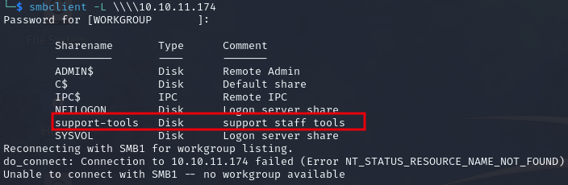

We can connect to the share and list the contents with `smbclient \\\\support.htb\\support-tools`

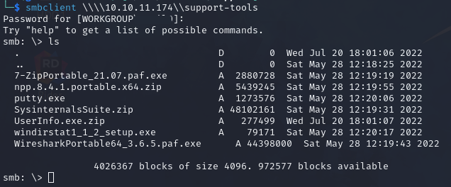

As the comment suggests, it contains various support tools. Most of them are well known except for
UserInfo.exe, and googling it doesn't give any useful information 

After downloading the zip and extracting the contents of UserInfo.exe.zip, we can use the `file` command and
see that it's a .Net PE that we can decompile with [ILSpy](https://github.com/icsharpcode/ILSpy)

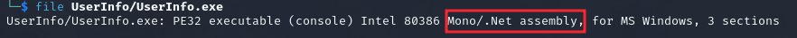

In ILSpy we find a couple of interesting Classes in the UserInfo.Services namespace: LdapQuery and Protected

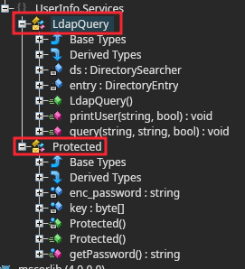

LdapQuery has a method called LdapQuery that is used to connect with the LDAP server on the target and the 
query method below is used to query the server using the connection established by LdapQuery

This gives us the username `ldap` (`support\\ldap` -> `domain\\username`)

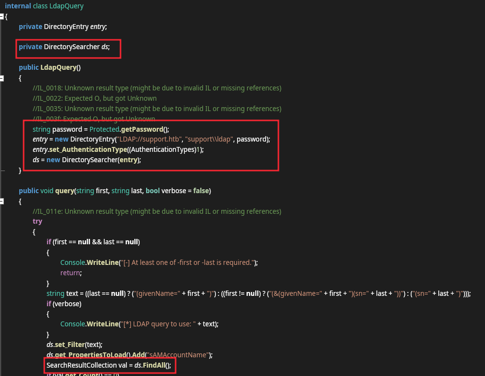

The Protected Class contains a method getPassword that decrypts the cipher text stored in enc_password using
2 keys

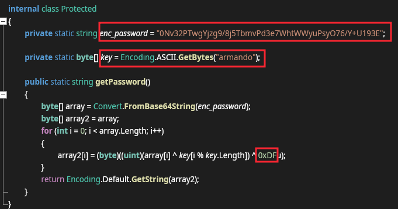

We can extract this code and create a .Net console application or use python to decrypt the password

```
#!/usr/bin/env python3
import base64

enc_password = base64.b64decode("0Nv32PTwgYjzg9/8j5TbmvPd3e7WhtWWyuPsyO76/Y+U193E")
# XOR key
key = b"armando"
# byte 0xDFu -> 223 (u is C# suffix for uint byte value)
key2 = 223

password = ''

for i in range(0, len(enc_password)):
    password += chr(enc_password[i] ^ key[i % len(key)] ^ key2)

print(password)
```

Now that we have the username and password we can use `ldapsearch` or `ldapdomaindump` to query the server 
and enumerate the users and groups on the target

`ldapsearch -H ldap://support.htb:3268 -D ldap@support.htb -w 'password' -b "cn=Users,dc=support,dc=htb"`
`ldapdomaindump -u support\\ldap -p 'password' ldap://support.htb:3268 -o ldap -at SIMPLE`

### Exploitation

*The box appears to be broken currently as we should see a custom tag in the support user object but 
regardless of the tool used it's not visible*

Enumerating the users we find a custom tag on the support user which appears to be a password, and that they 
are a member of the Remote Management Users Group which allows us to use WinRM as the support user

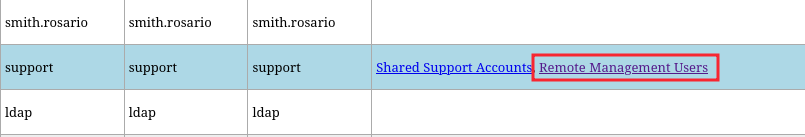

Using `evil-winrm` we get a shell on the target

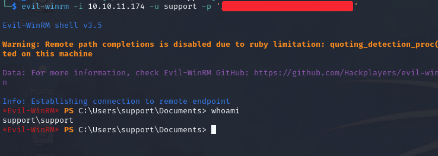

### Privilege Escalation

Now that we have user credentials for the target we can enumerate the target

Based on the services we found during our scanning the target is an AD machine, so we can enumerate it with 
Bloodhound

Upload the SharpHound.exe or .ps1 version corresponding to our Bloodhound version and run it on the target

Bloodhound shows that the Shared Support Accounts Group has GenericAll permissions over the DC

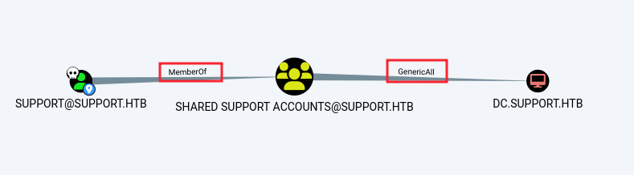

This means we can perform a Resource Based Constrained Delegation Attack to gain Admin privileges if three 
conditions are met

1. We need code execution as a Domain user in the `Authenticated Users` Group  
2. The `ms-ds-machineaccountquota` attribute to be > 0  
3. The Domain user that we have code execution with needs write privileges over a domain joined machine

We can check our current user is part of the Authenticated Users group with `whoami /groups` or with 
Bloodhound

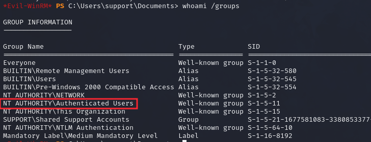
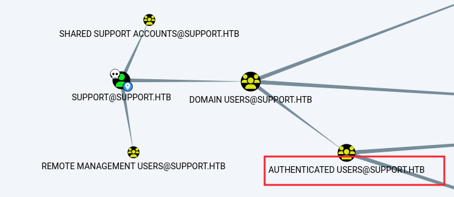

### Lessons Learned

- Check file type of any uncommon PE's to see if we can decompile them  
- DNSpy and ILSpy for decompiling .Net  
- Specify auth type for ldapdomaindump with `-at SIMPLE/NTLM`  
- Custom object tags aren't always visible with ldapsearch and ldapdomaindump
- Resource Based Constrained Delegation (RBCD) attacks require:  
    - code execution as a domain user that belongs to the Authenticated Users Group  
    - `ms-ds-machineaccountquota` attribute to be > 0 (Use `Get-ADObject`)  
    - current user needs `WRITE` privileges (`GenericAll/WriteDACL`) over a domain joined machine  

